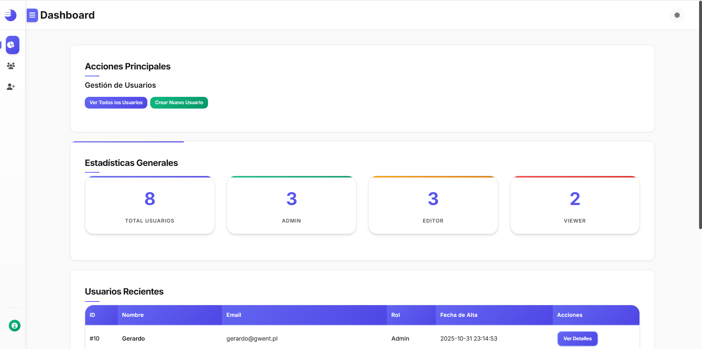
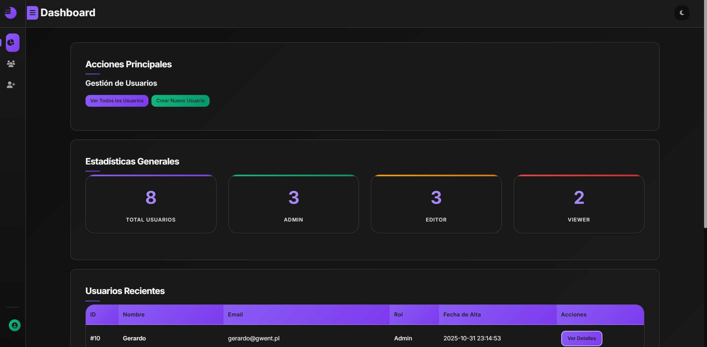
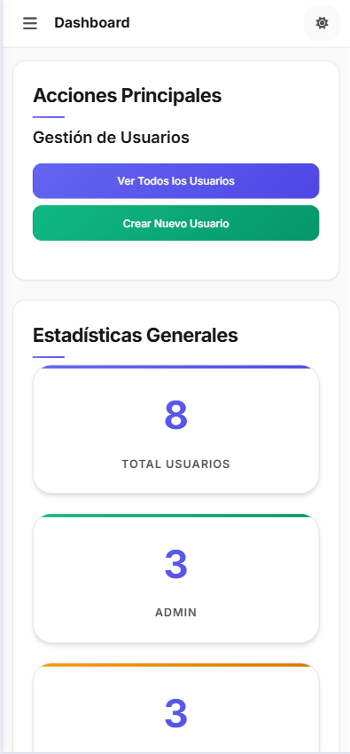

# CRUDle

CRUDle (CRUD + simpLE) is the prototype of a modern, responsive PHP CRUD (Create, Read, Update, Delete) application for user management with a clean UI, dark theme support, and CSV-based data storage.

<p align="center">
  
</p>

<p align="center">
  
  
  
</p>

---

## Table of Contents

- [Features](#features)
- [Demo](#demo)
- [Tech Stack](#tech-stack)
- [Prerequisites](#prerequisites)
- [Installation](#installation)
- [Usage](#usage)
- [Project Structure](#project-structure)
- [Architecture](#architecture)
- [Configuration](#configuration)
- [License](#license)
- [Author](#author)

---

## Features

### Core Functionality
- **Complete CRUD Operations** - Create, Read, Update, and Delete users
- **User Management** - Name, email, role, and avatar support
- **Avatar Upload** - Support for JPEG, PNG, GIF, and SVG images (max 2MB)
- **Dashboard** - Real-time statistics and recent user activity
- **User Details View** - Comprehensive user information display

### User Experience
- **Dark/Light Theme** - Persistent theme toggle with localStorage
- **Fully Responsive** - Mobile-first design with adaptive layouts
- **Smooth Animations** - Page transitions and UI interactions
- **User Feedback** - Success/error messages with visual indicators
- **Confirmation Dialogs** - For sensitive operations like deletion

### Technical Features
- **Input Validation** - Server-side validation for all user inputs
- **XSS Protection** - Output escaping and sanitization
- **CSV Storage** - Lightweight file-based data persistence
- **Error Handling** - Comprehensive error management system
- **MVC-Inspired** - Clean separation of concerns
- **Modular JavaScript** - Organized, reusable ES6 modules

---

## Demo

### Light Theme


### Dark Theme


### Mobile View


> **Note:** Screenshots are illustrative. The actual UI may vary.

---

## Tech Stack

### Backend
- **PHP 8.1+** - Server-side scripting
- **CSV** - Data storage format

### Frontend
- **HTML5** - Semantic markup
- **CSS3** - Modern styling with CSS Grid and Flexbox
- **Vanilla JavaScript** - No frameworks, pure ES6+

### Development
- **Apache/XAMPP** - Local development server
- **Git** - Version control

---

## Prerequisites

Before you begin, ensure you have the following installed:

- **PHP** 8.1 or higher
- **Apache** web server (or XAMPP/WAMP/MAMP)
- **Git** (optional, for cloning)
- A modern web browser (Chrome, Firefox, Safari, Edge)

---

## Installation

### Option 1: Clone the Repository

```bash
# Clone the repository
git clone https://github.com/EsderJ10/CRUDle.git

# Navigate to the project directory
cd CRUDle

# If using XAMPP, move to htdocs
# Windows: C:\xampp\htdocs\CRUDle
# Linux/Mac: /opt/lampp/htdocs/CRUDle
```

### Option 2: Download ZIP

1. Download the [latest release](https://github.com/EsderJ10/CRUDle/releases)
2. Extract to your web server's document root
3. Rename the folder to `CRUDle` (optional)

### Setup Steps

1. **Configure the Web Root**

   Edit `config/paths.php` if your application is not in the root directory:

   ```php
   // If your app is at http://localhost/CRUDle/
   define('WEB_ROOT', '/CRUDle');
   
   // If your app is at http://localhost/
   define('WEB_ROOT', '');
   ```

2. **Set Permissions**

   Ensure the following directories are writable:

   ```bash
   chmod 755 data/
   chmod 755 uploads/avatars/
   chmod 755 logs/
   ```

3. **Initialize Data File**

   The `data/usuarios.csv` file should already exist. If not, create it:

   ```csv
   ID,Nombre,Email,Rol,FechaAlta,Avatar
   ```

4. **Start Your Server**

   ```bash
   # If using XAMPP, start Apache
   # Or use PHP's built-in server:
   php -S localhost:8000
   ```

5. **Access the Application**

   Open your browser and navigate to:
   - `http://localhost/CRUDle/` (if using XAMPP)
   - `http://localhost:8000/` (if using PHP server)

---

## Usage

### Dashboard

The dashboard provides an overview of your user database:
- Total user count
- Users by role (Admin, Editor, Viewer)
- Recent user additions
- Quick action buttons

### Creating a User

1. Click **"Crear Nuevo Usuario"** from the dashboard or user list
2. Fill in the required fields:
   - **Nombre** (Name): 2-100 characters, letters only
   - **Email**: Valid email format
   - **Rol** (Role): Admin, Editor, or Viewer
   - **Avatar**: Optional image upload (max 2MB)
3. Click **"Crear Usuario"**
4. View success message and user details

### Viewing Users

- Access **"Ver Todos los Usuarios"** to see a complete list
- Each user displays avatar, name, email, role, and registration date
- Actions available: View, Edit, Delete

### Editing a User

1. Click the **Edit** icon next to any user
2. Modify the desired fields
3. Upload a new avatar or check **"Eliminar Avatar"** to remove it
4. Click **"Guardar Cambios"**

### Deleting a User

1. Click the **Delete** icon next to any user
2. Confirm the deletion when prompted
3. The user and their avatar will be removed

### Theme Toggle

- Click the **moon/sun icon** in the sidebar to switch themes
- Your preference is saved automatically

---

## Project Structure

```
CRUDle/
├── assets/                    # Static assets
│   ├── css/                   # Stylesheets
│   │   ├── styles.css         # Main application styles
│   │   └── error.css          # Error page styles
│   ├── images/                # Images and icons
│   │   └── default-avatar.svg # Default user avatar
│   └── js/                    # JavaScript modules
│       ├── app.js             # Core application module
│       ├── dashboard.js       # Sidebar and theme management
│       ├── theme-init.js      # Theme initialization
│       └── user-form.js       # User form interactions
│
├── config/                    # Configuration files
│   ├── config.php             # Application constants
│   └── paths.php              # Path definitions and helpers
│
├── data/                      # Data storage
│   └── usuarios.csv           # User data file
│
├── docs/                      # Documentation
│   ├── TECHNICAL_DOC.md       # Technical documentation
│   ├── ERROR_HANDLING_GUIDE.md
│   └── [other docs...]
│
├── lib/                       # Core library
│   ├── business/              # Business logic layer
│   │   └── user_operations.php # User CRUD operations
│   ├── core/                  # Core functionality
│   │   ├── csv.php            # CSV file operations
│   │   ├── validation.php     # Input validation
│   │   ├── sanitization.php   # Data sanitization
│   │   ├── exceptions.php     # Custom exceptions
│   │   └── error_handler.php  # Error handling
│   ├── helpers/               # Helper utilities
│   │   ├── enums.php          # Enum definitions
│   │   └── utils.php          # Utility functions
│   └── presentation/          # Presentation layer
│       └── user_views.php     # HTML rendering functions
│
├── logs/                      # Application logs
│   └── error.log              # Error log file
│
├── pages/                     # Application pages
│   ├── error_page.php         # Error display page
│   └── users/                 # User management pages
│       ├── user_index.php     # List all users
│       ├── user_create.php    # Create new user
│       ├── user_edit.php      # Edit existing user
│       ├── user_info.php      # View user details
│       └── user_delete.php    # Delete user
│
├── uploads/                   # User uploads
│   └── avatars/               # User avatar images
│
├── views/                     # View templates
│   ├── components/            # Reusable components
│   │   └── forms/
│   │       └── user_form.php  # User form template
│   └── partials/              # Partial templates
│       ├── header.php         # Header with sidebar
│       └── footer.php         # Footer
│
├── index.php                  # Application entry point
├── README.md                  # This file
└── TODO.md                    # Project tasks
```

---

## Architecture

CRUDle follows an **MVC-inspired architecture** with clear separation of concerns:

### Layers

```
┌─────────────────────────────────────────────┐
│           Presentation Layer                │
│  (user_views.php, header.php, footer.php)   │
└─────────────────┬───────────────────────────┘
                  │
┌─────────────────▼───────────────────────────┐
│              Page Layer                     │
│    (user_*.php - Request routing)           │
└─────────────────┬───────────────────────────┘
                  │
┌─────────────────▼───────────────────────────┐
│          Business Logic Layer               │
│       (user_operations.php)                 │
└─────────────────┬───────────────────────────┘
                  │
┌─────────────────▼───────────────────────────┐
│             Core Layer                      │
│  (csv.php, validation.php, sanitization.php)│
└─────────────────┬───────────────────────────┘
                  │
┌─────────────────▼───────────────────────────┐
│            Data Layer                       │
│  (usuarios.csv, avatar files)               │
└─────────────────────────────────────────────┘
```

### Key Design Patterns

- **Separation of Concerns**: Each layer has a specific responsibility
- **Single Responsibility Principle**: Functions do one thing well
- **DRY (Don't Repeat Yourself)**: Reusable functions and components
- **Module Pattern**: JavaScript organized in self-contained modules
- **Template Pattern**: Consistent HTML structure with partials

### Request Flow

```
User Action → HTTP Request → Page Router → Business Logic 
→ Data Operations → Response Generation → HTML Output
```

For detailed architecture documentation, see [TECHNICAL_DOC.md](docs/TECHNICAL_DOC.md).

---

## Configuration

### Application Settings

Edit `config/config.php`:

```php
// Application
define('APP_NAME', 'CRUD PHP Application');
define('APP_VERSION', '1.0.0');
define('APP_ENV', 'development'); // 'production' for live

// Data
define('DATA_FILE', 'data/usuarios.csv');

// Date Format
define('DATE_FORMAT', 'Y-m-d H:i:s');
define('DISPLAY_DATE_FORMAT', 'd/m/Y H:i');

// Validation Limits
define('MAX_NAME_LENGTH', 100);
define('MAX_EMAIL_LENGTH', 150);
define('MIN_NAME_LENGTH', 2);
```

### Path Configuration

Edit `config/paths.php`:

```php
// Web root (URL path)
define('WEB_ROOT', '/CRUDle'); // Adjust for your setup

// File system paths (auto-configured)
define('BASE_PATH', __DIR__ . '/../');
define('LIB_PATH', BASE_PATH . 'lib/');
define('DATA_PATH', BASE_PATH . 'data/');
define('UPLOADS_PATH', BASE_PATH . 'uploads/');
```

### Avatar Upload Settings

Maximum file size and allowed types are defined in `lib/core/validation.php`:

```php
// Max 2MB
$maxSize = 2 * 1024 * 1024;

// Allowed types
$allowedTypes = ['image/jpeg', 'image/png', 'image/gif', 'image/svg+xml'];
$allowedExtensions = ['jpg', 'jpeg', 'png', 'gif', 'svg'];
```

---

## License

CRUDle is licensed under the **MIT License**.

```
MIT License

Copyright (c) 2025 José Antonio Cortés Ferre

Permission is hereby granted, free of charge, to any person obtaining a copy
of this software and associated documentation files (the "Software"), to deal
in the Software without restriction, including without limitation the rights
to use, copy, modify, merge, publish, distribute, sublicense, and/or sell
copies of the Software, and to permit persons to whom the Software is
furnished to do so, subject to the following conditions:

The above copyright notice and this permission notice shall be included in all
copies or substantial portions of the Software.

THE SOFTWARE IS PROVIDED "AS IS", WITHOUT WARRANTY OF ANY KIND, EXPRESS OR
IMPLIED, INCLUDING BUT NOT LIMITED TO THE WARRANTIES OF MERCHANTABILITY,
FITNESS FOR A PARTICULAR PURPOSE AND NONINFRINGEMENT. IN NO EVENT SHALL THE
AUTHORS OR COPYRIGHT HOLDERS BE LIABLE FOR ANY CLAIM, DAMAGES OR OTHER
LIABILITY, WHETHER IN AN ACTION OF CONTRACT, TORT OR OTHERWISE, ARISING FROM,
OUT OF OR IN CONNECTION WITH THE SOFTWARE OR THE USE OR OTHER DEALINGS IN THE
SOFTWARE.
```

## Author

**José Antonio Cortés Ferre**

- GitHub: [@EsderJ10](https://github.com/EsderJ10)
- Repository: [CRUDle](https://github.com/EsderJ10/CRUDle)

---

## Acknowledgments

- Icons from [Font Awesome](https://fontawesome.com/)
- Default avatar design inspired by modern UI practices
- CSS animations inspired by the web development community

---

## Project Status

**Current Version:** 1.0.0  
**Status:** Active Development  
**Last Updated:** November 1, 2025

### Completed Features 

- Full CRUD operations
- Avatar upload and management
- Dark/Light theme toggle
- Responsive design
- Input validation and sanitization
- Error handling system
- Dashboard with statistics
- Confirmation dialogs
- Smooth animations

### Planned Features 

- 🔄 Database migration (SQLite/MySQL)
- 🔄 User authentication
- 🔄 Role-based permissions
- 🔄 Search and filter functionality
- 🔄 Pagination for large datasets
- 🔄 Export users (CSV, JSON)
- 🔄 Bulk operations
- 🔄 Activity logging
- 🔄 Unit and integration tests

---

## ❓ FAQ

**Q: Can I use this in production?**  
A: While the code is production-ready in terms of quality, CSV storage is not recommended for high-traffic applications. Consider migrating to a database for production use.

**Q: What browsers are supported?**  
A: All modern browsers (Chrome, Firefox, Safari, Edge) with ES6 support.

**Q: How do I change the default theme?**  
A: Edit `assets/js/theme-init.js` and change the default theme setting, or simply toggle it in the UI—your preference is saved.

**Q: Can I customize the roles?**  
A: Yes, edit the role options in `lib/core/validation.php` and update the form in `views/components/forms/user_form.php`.

**Q: How do I migrate to a database?**  
A: Replace the CSV operations in `lib/core/csv.php` with database queries. The business logic layer can remain largely unchanged.

**Q: Can I extend the user model with more fields?**  
A: Yes, add the new fields to the CSV structure, update the validation and sanitization functions, and modify the user forms and views accordingly. The idea is to keep the architecture flexible for such extensions.

**Q: Where can I find the documentation?**  
A: Detailed documentation is available in the `docs/` directory, including [TECHNICAL_DOC.md](docs/TECHNICAL_DOC.md) for architecture and design patterns.

**Q: How do I report bugs or request features?**  
A: Use the [GitHub Issues](https://github.com/EsderJ10/CRUDle/issues) page to report bugs or request new features.

---

## Star History

If you find this project useful, please consider giving it a ⭐ on GitHub!

---

<div align="center">

<strong>Made with ❤️ and ☕ by <a href="https://github.com/EsderJ10">José Antonio Cortés Ferre</a></strong>

[Report Bug](https://github.com/EsderJ10/CRUDle/issues) · [Request Feature](https://github.com/EsderJ10/CRUDle/issues) · [Documentation](docs/TECHNICAL_DOC.md)

</div>
