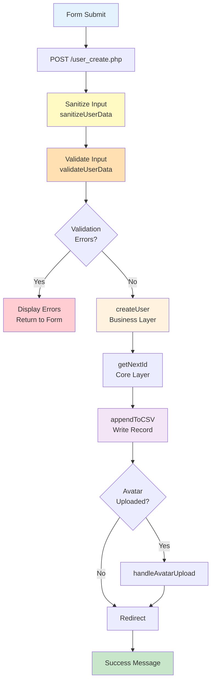

<div align="center">

# CRUDle - Technical Documentation


**A comprehensive technical guide for experienced PHP developers**

*Master the architecture, implementation details, and best practices of CRUDle*

---

**Last Updated:** November 1, 2025 | **Maintained by:** [José Antonio Cortés Ferre](https://github.com/EsderJ10)

[User Guide](../README.md) · [Report Issue](https://github.com/EsderJ10/CRUDle/issues) · [Request Feature](https://github.com/EsderJ10/CRUDle/issues/new)

</div>

---

## Table of Contents

<table>
<tr>
<td width="50%" valign="top">

### Part 1: Core Architecture

1. [Architecture Overview](#1-architecture-overview)
2. [Project Structure Deep Dive](#2-project-structure-deep-dive)
3. [Core Layer Implementation](#3-core-layer-implementation)
4. [Business Logic Layer](#4-business-logic-layer)
5. [Exception Hierarchy & Error Handling](#5-exception-hierarchy--error-handling)
6. [Sanitization Layer](#6-sanitization-layer)

</td>
<td width="50%" valign="top">

### Part 2: Frontend & Operations

7. [Presentation Layer](#7-presentation-layer)
8. [Frontend Architecture](#8-frontend-architecture)
9. [Performance & Optimization](#9-performance--optimization)
10. [Security Considerations](#10-security-considerations)
11. [Testing Strategies](#11-testing-strategies)
12. [Deployment Guide](#12-deployment-guide)

</td>
</tr>
</table>

---

<div align="center">

## Part 1: Core Architecture

*Understanding the foundation and internal mechanisms*

</div>

---

## 1. Architecture Overview

> **Key Insight:** CRUDle demonstrates how Clean Architecture principles can be successfully applied to procedural PHP, proving that good architecture isn't exclusive to object-oriented programming.

### 1.1 Design Philosophy

CRUDle implements a **layered architecture** inspired by Domain-Driven Design (DDD) and Clean Architecture principles, adapted for a PHP procedural context with modern PHP 8.1 features.

#### Key Architectural Decisions

| Decision | Rationale | Trade-off |
|----------|-----------|-----------|
| **Procedural over OOP** | Simplicity, reduced overhead for small-scale apps | Less abstraction flexibility |
| **Function-based modularity** | Clear, focused responsibilities per file | Manual dependency management |
| **PHP 8.1 Enums** | Type-safe role management | Requires PHP 8.1+ |
| **Custom exception hierarchy** | Domain-specific error handling | More exception classes to maintain |
| **Clear layer separation** | Maintainability, testability | More files, explicit dependencies |
| **CSV data layer** | Zero database setup, portable | Limited scalability |

### 1.2 Layered Architecture

```
╔═════════════════════════════════════════════════════════╗
║                    Entry Points                         ║
║  index.php, pages/users/*.php                           ║
║  • HTTP request handling                                ║
║  • Session management (future)                          ║
║  • Response coordination                                ║
╚═════════════════════╦═══════════════════════════════════╝
                      ║ requires/calls
╔═════════════════════╩═══════════════════════════════════╗
║              Presentation Layer                         ║
║  lib/presentation/user_views.php                        ║
║  • HTML generation                                      ║
║  • Output escaping                                      ║
║  • View composition                                     ║
╚═════════════════════╦═══════════════════════════════════╝
                      ║ uses
╔═════════════════════╩═══════════════════════════════════╗
║             Business Logic Layer                        ║
║  lib/business/user_operations.php                       ║
║  • Domain operations (CRUD)                             ║
║  • Business rules enforcement                           ║
║  • Avatar lifecycle management                          ║
║  • Statistics calculation                               ║
╚═════════════════════╦═══════════════════════════════════╝
                      ║ depends on
╔═════════════════════╩═══════════════════════════════════╗
║                Core Layer                               ║
║  lib/core/{csv, validation, sanitization, exceptions}   ║
║  • Data persistence operations                          ║
║  • Input validation rules                               ║
║  • Data transformation                                  ║
║  • Exception definitions                                ║
╚═════════════════════╦═══════════════════════════════════╝
                      ║ operates on
╔═════════════════════╩═══════════════════════════════════╗
║               Data Storage Layer                        ║
║  data/usuarios.csv, uploads/avatars/*                   ║
║  • CSV file storage                                     ║
║  • File system storage                                  ║
╚═════════════════════════════════════════════════════════╝
```

#### Layer Dependency Rules

- **Allowed:** Upper layers depend on lower layers
- **Allowed:** Same-level dependencies (with care)
- **Forbidden:** Lower layers depend on upper layers
- **Forbidden:** Skipping layers (e.g., Entry → Core without Business)

### 1.3 Data Flow Patterns

#### Read Operation Flow

```mermaid
graph LR
    A[User Request] --> B[GET /user_info.php?id=5]
    B --> C[Validate ID Parameter]
    C --> D[getUserById<br/>Business Layer]
    D --> E[findRecordById<br/>Core/CSV Layer]
    E --> F[getCSVRecords<br/>Read CSV File]
    F --> G[Array Search<br/>Match ID]
    G --> H[Return User<br/>or null]
    H --> I[renderUserInfo<br/>Presentation Layer]
    I --> J[HTML Output<br/>Escaped Data]
    
    style A fill:#e3f2fd
    style D fill:#fff3e0
    style E fill:#f3e5f5
    style I fill:#e8f5e9
    style J fill:#c8e6c9
```



**Example Code:**
```php
// Example: Viewing user details
GET /pages/users/user_info.php?id=5
  ↓
user_info.php validates ID parameter
  ↓
getUserById(5) [business layer]
  ↓
findRecordById(5) [core/csv.php]
  ↓
getCSVRecords() reads entire CSV
  ↓
Array search for ID match
  ↓
Return user array or null
  ↓
renderUserInfo($user) [presentation]
  ↓
HTML output with escaped data
```

#### Write Operation Flow



**Example Code:**
```php
// Example: Creating a new user
POST /pages/users/user_create.php
  ↓
Validate $_POST data (validateUserData)
  ↓
Sanitize input (sanitizeUserData)
  ↓
createUser($sanitizedData) [business layer]
  ↓
getNextId() [core/csv.php]
  ↓
appendToCSV($newRecord) [core/csv.php]
  ↓
fopen('a') → fputcsv() → fclose()
  ↓
if avatar: handleAvatarUpload()
  ↓
Redirect with success message
```

### 1.4 Dependency Management

> **Module System:** While PHP 8.1+ doesn't have native modules, we use `require_once` with path helpers to create explicit, maintainable dependencies.

#### Dependency Injection Pattern

```php
// Not using a DI container, but following dependency principles
// Each layer only depends on layers below it

// config/paths.php provides path resolution
require_once __DIR__ . '/../../config/paths.php';

// Then require dependencies in order
require_once getPath('lib/core/csv.php');
require_once getPath('lib/core/validation.php');
require_once getPath('lib/core/sanitization.php');
```

#### Why `require_once` over Autoloading?

| Aspect | `require_once` | PSR-4 Autoloader |
|--------|----------------|------------------|
| **Setup** | None | Composer, namespace config |
| **Performance** | Direct include | File lookup overhead |
| **Dependency Clarity** | Explicit at top of file | Implicit |
| **Debugging** | Simple stack trace | Class loader involved |
| **Best For** | Small projects (<50 files) | Large projects (>100 files) |

**The Choice:** Small codebase (< 20 PHP files) + Explicit dependency declaration = `require_once` wins

---

## 2. Project Structure Deep Dive

> **Organization Principle:** Every file has a single, clear responsibility. If you can't describe a file's purpose in one sentence, it needs refactoring.

### 2.1 Directory Organization

<details>
<summary><strong>Expand Full Project Tree</strong></summary>

```
CRUDle/
├── config/                    # Application configuration
│   ├── config.php             # Constants: APP_*, DATE_FORMAT, validation limits
│   └── paths.php              # Path resolution: getPath(), getWebPath()
│
├── lib/                       # Core application logic
│   ├── business/              # Domain/business logic layer
│   │   └── user_operations.php
│   │       ├── CRUD operations: getAllUsers(), getUserById(), createUser()
│   │       ├── Avatar management: handleAvatarUpload(), deleteAvatarFile()
│   │       └── Statistics: getUserStatistics()
│   │
│   ├── core/                  # Core infrastructure layer
│   │   ├── csv.php
│   │   │   ├── File operations: getCSVRecords(), writeCSVRecords()
│   │   │   ├── CRUD primitives: findRecordById(), updateRecordById()
│   │   │   └── Utilities: getNextId(), checkCSVStatus()
│   │   │
│   │   ├── validation.php
│   │   │   ├── Field validators: validateName(), validateEmail()
│   │   │   ├── File validator: validateAvatar()
│   │   │   └── Composite: validateUserData()
│   │   │
│   │   ├── sanitization.php
│   │   │   ├── Input cleaning: sanitizeName(), sanitizeEmail()
│   │   │   ├── Output escaping: sanitizeOutput()
│   │   │   └── CSV safety: sanitizeForCSV()
│   │   │
│   │   ├── exceptions.php
│   │   │   ├── Base: AppException
│   │   │   ├── Domain: CSVException, ValidationException
│   │   │   ├── Operation: UserOperationException, AvatarException
│   │   │   └── System: ResourceNotFoundException, InvalidStateException
│   │   │
│   │   └── error_handler.php
│   │       ├── Global handlers: set_error_handler(), set_exception_handler()
│   │       ├── Logging: logError(), logException()
│   │       └── Display: displayUserFriendlyError()
│   │
│   ├── helpers/               # Utility functions and types
│   │   ├── enums.php          # Role enum (PHP 8.1)
│   │   └── utils.php          # Miscellaneous utilities
│   │
│   └── presentation/          # View/output generation layer
│       └── user_views.php
│           ├── Table rendering: renderUserTable()
│           ├── Detail views: renderUserInfo()
│           ├── Forms: renderEditForm()
│           ├── Messages: renderMessage()
│           └── Dashboard: renderDashboardStats()
│
├── pages/                     # Page controllers (entry points)
│   ├── error_page.php         # Global error display
│   └── users/                 # User management pages
│       ├── user_index.php     # List all users
│       ├── user_create.php    # Create form & handler
│       ├── user_edit.php      # Edit form & handler
│       ├── user_info.php      # View user details
│       └── user_delete.php    # Delete confirmation & handler
│
├── views/                     # Reusable view components
│   ├── components/
│   │   └── forms/
│   │       └── user_form.php  # Form fields partial
│   └── partials/
│       ├── header.php         # <head>, sidebar, navigation
│       └── footer.php         # </body>, scripts
│
├── assets/                    # Frontend resources
│   ├── css/
│   │   ├── styles.css         # Main stylesheet (~800 lines)
│   │   └── error.css          # Error page specific styles
│   ├── images/
│   │   └── default-avatar.svg
│   └── js/
│       ├── app.js             # Core application module
│       ├── dashboard.js       # Sidebar, theme, navigation
│       ├── theme-init.js      # Theme initialization on load
│       └── user-form.js       # Avatar upload interactions
│
├── data/                      # Data storage
│   └── usuarios.csv           # User records (ID,Nombre,Email,Rol,FechaAlta,Avatar)
│
├── uploads/                   # User-uploaded files
│   └── avatars/               # Avatar images (user_ID_name_avatar.ext)
│
├── logs/                      # Application logs
│   └── error.log              # Error and exception log
│
├── docs/                      # Documentation
│   ├── TECHNICAL_DOC.md       # This file
│   ├── ERROR_HANDLING_GUIDE.md
│   └── [other documentation files...]
│
├── public/                    # Public assets
│   ├── banner.png
│   └── screenshots/
│
├── index.php                  # Dashboard (application entry point)
├── README.md                  # User-facing documentation
├── TODO.md                    # Project task list
└── LICENSE                    # MIT License
```

</details>

### 2.2 File Naming Conventions

> **Consistency is key:** Predictable naming means faster navigation and reduced cognitive load.

| Type | Pattern | Example | Purpose |
|------|---------|---------|---------|
| **Page Controllers** | `{entity}_{action}.php` | `user_create.php` | CRUD operations |
| **Business Logic** | `{entity}_operations.php` | `user_operations.php` | Domain logic |
| **Core Services** | `{concern}.php` | `validation.php` | Infrastructure |
| **View Functions** | `{entity}_views.php` | `user_views.php` | HTML generation |
| **Enums/Types** | `{plural}.php` | `enums.php` | Type definitions |
| **Configs** | `{purpose}.php` | `config.php`, `paths.php` | Configuration |

### 2.3 Configuration Management

#### config/config.php

<details>
<summary><strong>View Configuration Constants</strong></summary>

```php
<?php
// Application metadata
define('APP_NAME', 'CRUD PHP Application');
define('APP_VERSION', '1.0.0');
define('APP_ENV', 'development'); // 'production' for live

// Data layer configuration
define('DATA_FILE', 'data/usuarios.csv');
define('DATA_DIR', 'data/');

// Date/time formatting
define('DATE_FORMAT', 'Y-m-d H:i:s');          // Storage format
define('DISPLAY_DATE_FORMAT', 'd/m/Y H:i');    // Display format

// Validation constraints
define('MAX_NAME_LENGTH', 100);
define('MAX_EMAIL_LENGTH', 150);
define('MIN_NAME_LENGTH', 2);

// System limits
define('ERROR_LOG_MAX_SIZE', 5 * 1024 * 1024); // 5MB
?>
```

**Usage Pattern:**
```php
// Always require config early in file dependency chain
require_once getPath('config/config.php');

// Use constants directly
$maxLength = MAX_NAME_LENGTH;
$timestamp = date(DATE_FORMAT);
```

#### config/paths.php
```php
<?php
// Base paths
define('WEB_ROOT', '/CRUDle');              // URL base path
define('BASE_PATH', __DIR__ . '/../');      // Filesystem base

// Calculated paths
define('LIB_PATH', BASE_PATH . 'lib/');
define('DATA_PATH', BASE_PATH . 'data/');
define('UPLOADS_PATH', BASE_PATH . 'uploads/');
define('LOGS_PATH', BASE_PATH . 'logs/');

/**
 * Resolve relative path to absolute filesystem path
 * @param string $relativePath Path relative to BASE_PATH
 * @return string Absolute filesystem path
 */
function getPath($relativePath) {
    return BASE_PATH . $relativePath;
}

/**
 * Resolve relative path to web-accessible URL path
 * @param string $relativePath Path relative to WEB_ROOT
 * @return string Web URL path
 */
function getWebPath($relativePath = '') {
    return WEB_ROOT . '/' . $relativePath;
}

/**
 * Get avatar storage directory path
 * @return string Absolute path to avatar directory
 */
function getAvatarPath() {
    return UPLOADS_PATH . 'avatars/';
}

/**
 * Get web path for uploaded files
 * @param string $filename Filename relative to uploads/
 * @return string Web URL path to file
 */
function getWebUploadPath($filename) {
    return WEB_ROOT . '/uploads/' . $filename;
}
?>
```

**Path Resolution Examples:**
```php
// Filesystem paths (for file operations)
$csvPath = getPath('data/usuarios.csv');
// Result: /var/www/html/CRUDle/data/usuarios.csv

$libFile = getPath('lib/core/csv.php');
// Result: /var/www/html/CRUDle/lib/core/csv.php

// Web paths (for HTML output)
$avatarUrl = getWebPath('assets/images/default-avatar.svg');
// Result: /CRUDle/assets/images/default-avatar.svg

$userAvatar = getWebUploadPath('avatars/user_5_john_avatar.jpg');
// Result: /CRUDle/uploads/avatars/user_5_john_avatar.jpg
```

---

<div align="center">

## 3. Core Layer Implementation

*The foundation: Data persistence, validation, and infrastructure*

</div>

---

### 3.1 CSV Data Persistence Layer

> **File:** `lib/core/csv.php` | **LOC:** ~250 | **Functions:** 8 core operations

#### 3.1.1 Design Rationale

**Why CSV over Database?**

<table>
<tr>
<td width="50%" valign="top">

##### Advantages

- Zero configuration required
- Human-readable format
- Version control friendly
- Fast for < 10,000 records
- Portable (no database dump needed)
- Easy debugging (open in Excel/text editor)

</td>
<td width="50%" valign="top">

##### Trade-offs

- No ACID guarantees
- No built-in indexing
- Linear search complexity O(n)
- Concurrent access risks
- Limited to tabular data
- No referential integrity

</td>
</tr>
</table>

**Performance Characteristics:**

| Operation | Time Complexity | Space Complexity | Notes |
|-----------|----------------|------------------|-------|
| Read all records | O(n) | O(n) | Loads entire file |
| Find by ID | O(n) | O(n) | Linear search |
| Append record | O(1) | O(1) | ✅ Optimal |
| Update record | O(n) | O(n) | Read + filter + write |
| Delete record | O(n) | O(n) | Read + filter + write |

> **Performance Tip:** For read-heavy workloads with >1000 records, consider migrating to SQLite for better indexed searches.

#### 3.1.2 Data Format Specification

**CSV File Structure:**

```csv
ID,Nombre,Email,Rol,FechaAlta,Avatar
1,Juan Pérez,juan@example.com,admin,"2025-10-15 14:32:10",/CRUDle/uploads/avatars/user_1_juan_avatar.jpg
2,María García,maria@example.com,editor,"2025-10-16 09:15:42",
3,Carlos López,carlos@example.com,viewer,"2025-10-17 18:22:55",/CRUDle/uploads/avatars/user_3_carlos_avatar.png
```

**Field Specifications:**

| Column | Type | Constraints | Description |
|--------|------|-------------|-------------|
| **ID** | Integer | Primary key, auto-increment | Unique user identifier |
| **Nombre** | String | 2-100 chars, letters/spaces | User's full name |
| **Email** | String | Max 150 chars, RFC 5322 valid | Email address (unique recommended) |
| **Rol** | Enum | `admin`\|`editor`\|`viewer` | User role (PHP 8.1 enum) |
| **FechaAlta** | DateTime | `Y-m-d H:i:s` format | Registration timestamp |
| **Avatar** | String/Null | Optional, web path | Avatar URL or empty string |

---

#### 3.1.3 Core Functions Reference

##### `getCSVRecords()` - Read All Records

<details>
<summary><strong>View Complete Implementation</strong></summary>

**Function Signature:**

```php
/**
 * Read all records from CSV file
 * 
 * @param string|null $filePath Path to CSV file (defaults to DATA_FILE)
 * @return array Array of arrays, each inner array is a CSV row
 * @throws CSVException If file cannot be read
 * 
 * ⏱️ Time Complexity: O(n) where n = number of records
 * 💾 Space Complexity: O(n) - entire file loaded into memory
 */
function getCSVRecords($filePath = null): array {
    if ($filePath === null) {
        $filePath = getPath(DATA_FILE);
    }
    
    $records = [];
    
    // Early return if file doesn't exist
    if (!file_exists($filePath)) {
        return $records;
    }
    
    try {
        $handle = @fopen($filePath, 'r');
        if ($handle === false) {
            throw new CSVException(
                'Unable to open CSV file for reading: ' . $filePath,
                'Error al acceder al archivo de datos.'
            );
        }
        
        // Read line by line using fgetcsv for proper CSV parsing
        while (($data = fgetcsv($handle)) !== FALSE) {
            // Validate row has minimum required columns (5)
            // Columns: ID, Nombre, Email, Rol, FechaAlta (Avatar optional)
            if (count($data) >= 5) {
                $records[] = $data;
            }
        }
        
        fclose($handle);
    } catch (CSVException $e) {
        throw $e;
    } catch (Exception $e) {
        throw new CSVException(
            'CSV reading error: ' . $e->getMessage(),
            'Error al leer el archivo de datos.',
            0,
            $e
        );
    }
    
    return $records;
}
```

**Usage:**
```php
try {
    $users = getCSVRecords();
    // $users = [
    //   [1, "Juan", "juan@email.com", "admin", "2025-10-15 14:32:10", "/path/avatar.jpg"],
    //   [2, "María", "maria@email.com", "editor", "2025-10-16 09:15:42", ""],
    //   ...
    // ]
} catch (CSVException $e) {
    // Handle read error
    error_log($e->getTechnicalMessage());
    die($e->getUserMessage());
}
```

##### writeCSVRecords()
```php
/**
 * Write all records to CSV file (full rewrite)
 * 
 * @param array $records Array of arrays to write
 * @param string|null $filePath Path to CSV file
 * @return bool True on success
 * @throws CSVException If write fails
 * 
 * Time Complexity: O(n) where n = number of records
 * Space Complexity: O(1) - writes line by line
 * 
 * WARNING: This function truncates the file before writing.
 *          Ensure $records contains ALL data, not just changes.
 */
function writeCSVRecords($records, $filePath = null): bool {
    if ($filePath === null) {
        $filePath = getPath(DATA_FILE);
    }
    
    try {
        // Ensure directory exists
        $dir = dirname($filePath);
        if (!is_dir($dir)) {
            if (!@mkdir($dir, 0755, true)) {
                throw new CSVException(
                    'Unable to create CSV directory: ' . $dir,
                    'Error al crear el directorio de datos.'
                );
            }
        }
        
        // Open in write mode (truncates file)
        $handle = @fopen($filePath, 'w');
        if ($handle === FALSE) {
            throw new CSVException(
                'Unable to open CSV file for writing: ' . $filePath,
                'Error al escribir en el archivo de datos.'
            );
        }
        
        // Write records line by line
        foreach ($records as $record) {
            if (fputcsv($handle, $record) === FALSE) {
                fclose($handle);
                throw new CSVException(
                    'Error writing record to CSV file',
                    'Error al guardar datos en el archivo.'
                );
            }
        }
        
        fclose($handle);
        return true;
    } catch (CSVException $e) {
        throw $e;
    } catch (Exception $e) {
        throw new CSVException(
            'CSV writing error: ' . $e->getMessage(),
            'Error al guardar el archivo de datos.',
            0,
            $e
        );
    }
}
```

##### appendToCSV()
```php
/**
 * Append a single record to CSV file
 * 
 * @param array $record Single record to append
 * @param string|null $filePath Path to CSV file
 * @return bool True on success
 * @throws CSVException If append fails
 * 
 * Time Complexity: O(1) - single write operation
 * Space Complexity: O(1)
 * 
 * Preferred for CREATE operations (doesn't read entire file)
 */
function appendToCSV($record, $filePath = null): bool {
    if ($filePath === null) {
        $filePath = getPath(DATA_FILE);
    }
    
    try {
        $dir = dirname($filePath);
        if (!is_dir($dir)) {
            if (!@mkdir($dir, 0755, true)) {
                throw new CSVException(
                    'Unable to create CSV directory: ' . $dir,
                    'Error al crear el directorio de datos.'
                );
            }
        }
        
        // Open in append mode (preserves existing content)
        $handle = @fopen($filePath, 'a');
        if ($handle === FALSE) {
            throw new CSVException(
                'Unable to open CSV file for appending: ' . $filePath,
                'Error al acceder al archivo de datos.'
            );
        }
        
        if (fputcsv($handle, $record) === FALSE) {
            fclose($handle);
            throw new CSVException(
                'Error appending record to CSV file',
                'Error al guardar los datos.'
            );
        }
        
        fclose($handle);
        return true;
    } catch (CSVException $e) {
        throw $e;
    } catch (Exception $e) {
        throw new CSVException(
            'CSV append error: ' . $e->getMessage(),
            'Error al guardar el archivo de datos.',
            0,
            $e
        );
    }
}
```

##### findRecordById()
```php
/**
 * Find a single record by ID
 * 
 * @param mixed $id Record ID to search for
 * @param string|null $filePath Path to CSV file
 * @return array|null Record array or null if not found
 * 
 * Time Complexity: O(n) - linear search
 * Space Complexity: O(n) - loads all records
 * 
 * Optimization opportunity: Binary search if IDs are sorted
 */
function findRecordById($id, $filePath = null): ?array {
    $records = getCSVRecords($filePath);
    
    foreach ($records as $record) {
        // Loose comparison (==) intentional: "5" == 5
        if (isset($record[0]) && $record[0] == $id) {
            return $record;
        }
    }
    
    return null;
}
```

##### updateRecordById()
```php
/**
 * Update a record by ID
 * 
 * @param mixed $id Record ID to update
 * @param array $newRecord Complete new record data
 * @param string|null $filePath Path to CSV file
 * @return bool True if record was found and updated
 * 
 * Time Complexity: O(n) read + O(n) write = O(n)
 * Space Complexity: O(n)
 * 
 * Process:
 * 1. Read all records into memory
 * 2. Find and replace matching record
 * 3. Write entire file back
 */
function updateRecordById($id, $newRecord, $filePath = null): bool {
    $records = getCSVRecords($filePath);
    $updated = false;
    
    // Linear search for record
    for ($i = 0; $i < count($records); $i++) {
        if (isset($records[$i][0]) && $records[$i][0] == $id) {
            $records[$i] = $newRecord;
            $updated = true;
            break; // Stop after first match (IDs should be unique)
        }
    }
    
    // Only rewrite file if record was found
    if ($updated) {
        return writeCSVRecords($records, $filePath);
    }
    
    return false;
}
```

##### deleteRecordById()
```php
/**
 * Delete a record by ID
 * 
 * @param mixed $id Record ID to delete
 * @param string|null $filePath Path to CSV file
 * @return bool True if record was found and deleted
 * 
 * Time Complexity: O(n) read + O(n) filter + O(n) write = O(n)
 * Space Complexity: O(n)
 * 
 * Process:
 * 1. Read all records
 * 2. Filter out matching record
 * 3. Rewrite file with remaining records
 */
function deleteRecordById($id, $filePath = null): bool {
    $records = getCSVRecords($filePath);
    $filteredRecords = [];
    $found = false;
    
    foreach ($records as $record) {
        if (isset($record[0]) && $record[0] == $id) {
            $found = true;
            continue; // Skip this record (delete it)
        }
        $filteredRecords[] = $record;
    }
    
    if ($found) {
        return writeCSVRecords($filteredRecords, $filePath);
    }
    
    return false;
}
```

##### getNextId()
```php
/**
 * Calculate next available ID (max + 1)
 * 
 * @param string|null $filePath Path to CSV file
 * @return int Next ID to use
 * 
 * Time Complexity: O(n)
 * Space Complexity: O(n)
 * 
 * Algorithm: Find maximum numeric ID and increment
 * Note: Not thread-safe for concurrent inserts
 */
function getNextId($filePath = null): int {
    $records = getCSVRecords($filePath);
    $maxId = 0;
    
    foreach ($records as $record) {
        if (isset($record[0]) && is_numeric($record[0])) {
            $maxId = max($maxId, (int)$record[0]);
        }
    }
    
    return $maxId + 1;
}
```

##### checkCSVStatus()
```php
/**
 * Get diagnostic information about CSV file
 * 
 * @param string|null $filePath Path to CSV file
 * @return array Status information
 * 
 * Useful for:
 * - Startup checks
 * - Dashboard status display
 * - Troubleshooting
 */
function checkCSVStatus($filePath = null): array {
    if ($filePath === null) {
        $filePath = getPath(DATA_FILE);
    }
    
    $dir = dirname($filePath);
    
    return [
        'fileExists' => file_exists($filePath),
        'dirExists' => is_dir($dir),
        'dirWritable' => is_writable($dir),
        'fileWritable' => file_exists($filePath) ? is_writable($filePath) : is_writable($dir),
        'filePath' => $filePath
    ];
}
```

**Usage Example:**
```php
$status = checkCSVStatus();

if (!$status['fileExists']) {
    echo "WARNING: Data file does not exist. Creating...";
    writeCSVRecords([]); // Create empty file
}

if (!$status['fileWritable']) {
    die("ERROR: Cannot write to data file. Check permissions.");
}
```

### 3.2 Input Validation (lib/core/validation.php)

#### 3.2.1 Validation Philosophy

**Principles:**
1. **Fail Fast**: Validate as early as possible (before business logic)
2. **Collect All Errors**: Don't stop at first error (return array of all errors)
3. **Type Safety**: Use PHP 8.1 types and enums where applicable
4. **User-Friendly Messages**: Errors in Spanish, technical details in logs
5. **Exception-Based**: Use custom exceptions for structural errors

#### 3.2.2 Field Validators

##### validateName()
```php
/**
 * Validate user name field
 * 
 * Rules:
 * - Required (not empty)
 * - Length: 2-100 characters
 * - Characters: Letters (including Spanish), spaces
 * - Cannot be only numbers
 * 
 * @param string $name Name to validate
 * @return array Array of error messages (empty if valid)
 */
function validateName($name): array {
    $errors = [];
    
    // Required check
    if (empty($name)) {
        $errors[] = "El nombre es obligatorio.";
        return $errors; // Early return if empty
    }
    
    $name = trim($name);
    
    // Minimum length
    if (strlen($name) < MIN_NAME_LENGTH) {
        $errors[] = "El nombre debe tener al menos " . MIN_NAME_LENGTH . " caracteres.";
    }
    
    // Maximum length
    if (strlen($name) > MAX_NAME_LENGTH) {
        $errors[] = "El nombre no puede tener más de " . MAX_NAME_LENGTH . " caracteres.";
    }
    
    // Cannot be only digits
    if (preg_match('/^[0-9]+$/', $name)) {
        $errors[] = "El nombre no puede ser solo números.";
    }
    
    // Character whitelist (Spanish letters + spaces)
    // Pattern explanation:
    // a-zA-Z: English letters
    // áéíóúñÁÉÍÓÚÑ: Spanish accented letters and ñ
    // \s: Whitespace (spaces, tabs, newlines)
    if (!preg_match('/^[a-zA-ZáéíóúñÁÉÍÓÚÑ\s]+$/', $name)) {
        $errors[] = "El nombre solo puede contener letras y espacios.";
    }
    
    return $errors;
}
```

**Test Cases:**
```php
// Valid names
validateName("Juan Pérez");      // []
validateName("María José");       // []
validateName("Ñoño González");    // []

// Invalid names
validateName("");                 // ["El nombre es obligatorio."]
validateName("J");                // ["El nombre debe tener al menos 2 caracteres."]
validateName("123");              // ["El nombre no puede ser solo números."]
validateName("Juan123");          // ["El nombre solo puede contener letras y espacios."]
validateName(str_repeat("A", 101)); // ["El nombre no puede tener más de 100 caracteres."]
```

##### validateEmail()
```php
/**
 * Validate email field
 * 
 * Rules:
 * - Required (not empty)
 * - Valid email format (RFC 5322)
 * - Maximum length: 150 characters
 * 
 * @param string $email Email to validate
 * @return array Array of error messages (empty if valid)
 */
function validateEmail($email): array {
    $errors = [];
    
    if (empty($email)) {
        $errors[] = "El email es obligatorio.";
        return $errors;
    }
    
    $email = trim($email);
    
    // Length check
    if (strlen($email) > MAX_EMAIL_LENGTH) {
        $errors[] = "El email no puede tener más de " . MAX_EMAIL_LENGTH . " caracteres.";
    }
    
    // Format validation using PHP's built-in filter
    // Uses RFC 5322 standard
    if (!filter_var($email, FILTER_VALIDATE_EMAIL)) {
        $errors[] = "El email no tiene un formato válido.";
    }
    
    return $errors;
}
```

**Test Cases:**
```php
// Valid emails
validateEmail("user@example.com");          // []
validateEmail("test.user@domain.co.uk");    // []
validateEmail("name+tag@example.com");      // []

// Invalid emails
validateEmail("");                          // ["El email es obligatorio."]
validateEmail("notanemail");                // ["El email no tiene un formato válido."]
validateEmail("@example.com");              // ["El email no tiene un formato válido."]
validateEmail("user@");                     // ["El email no tiene un formato válido."]
validateEmail(str_repeat("a", 151) . "@x.com"); // ["El email no puede tener más de 150 caracteres."]
```

---

<div align="center">

## 4. Business Logic Layer

*Domain operations, business rules, and orchestration*

</div>

---

### 4.1 User Operations Module

> **File:** `lib/business/user_operations.php` | **LOC:** ~400 | **Functions:** 11 operations

This layer orchestrates CRUD operations and implements business rules. It sits between the presentation layer and the core data layer, providing high-level domain operations.

#### 4.1.1 Design Principles

##### Single Responsibility Pattern

```php
// Each function has one clear, focused purpose
getAllUsers()              // Retrieve all user records
getUserById($id)           // Retrieve single user by ID
createUser($data)          // Create new user with validation
updateUser($id, $data)     // Update existing user
deleteUserById($id)        // Delete user and cleanup
```

##### Error Handling Strategy

```php
// Layered try-catch hierarchy for granular error handling
try {
    // Attempt operation
} catch (CSVException $e) {
    // Data layer specific errors
    logException($e);
    throw new UserOperationException(
        'Data layer failed: ' . $e->getMessage(),
        $e->getUserMessage()
    );
} catch (UserOperationException $e) {
    // Business logic errors
    throw $e;
} catch (Exception $e) {
    // Unexpected errors - wrap in domain exception
    throw new UserOperationException(
        'Technical: ' . $e->getMessage(),
        'User-friendly message',
        0,
        $e
    );
}
```

#### 4.1.2 Avatar Management

##### handleAvatarUpload()
```php
/**
 * Upload and store user avatar
 * 
 * @param array $file $_FILES['avatar'] array
 * @param int|null $userId User ID (for filename)
 * @param string|null $userName User name (for filename)
 * @return string|null Web path to avatar or null
 * @throws AvatarException On upload failure
 * @throws FileUploadException On file handling errors
 * 
 * Process Flow:
 * 1. Validate upload (no file = return null)
 * 2. Check upload errors
 * 3. Ensure avatar directory exists
 * 4. Generate safe filename
 * 5. Remove old avatar (if user exists)
 * 6. Move uploaded file
 * 7. Return web-accessible path
 */
function handleAvatarUpload($file, $userId = null, $userName = null): ?string {
    try {
        // Step 1: Handle optional upload
        if (!isset($file) || $file['error'] === UPLOAD_ERR_NO_FILE) {
            return null; // No avatar uploaded
        }
        
        // Step 2: Validate upload succeeded
        if ($file['error'] !== UPLOAD_ERR_OK) {
            throw new FileUploadException(
                'File upload error: ' . $file['error'],
                'Error al procesar el archivo.'
            );
        }
        
        // Step 3: Ensure directory exists
        $uploadDir = getAvatarPath();
        if (!is_dir($uploadDir)) {
            if (!@mkdir($uploadDir, 0755, true)) {
                throw new AvatarException(
                    'Unable to create avatar directory: ' . $uploadDir,
                    'Error al crear el directorio de avatares.'
                );
            }
        }
        
        // Verify write permissions
        if (!is_writable($uploadDir)) {
            throw new AvatarException(
                'Avatar directory is not writable: ' . $uploadDir,
                'No hay permisos para guardar la imagen.'
            );
        }
        
        // Step 4: Generate safe filename
        // Pattern: user_{id}_{sanitized_name}_avatar.{ext}
        $extension = strtolower(pathinfo($file['name'], PATHINFO_EXTENSION));
        $safeUserName = $userName 
            ? preg_replace('/[^a-zA-Z0-9_-]/', '_', $userName) 
            : 'unknown';
        $filename = 'user_' . ($userId ?: 'temp') . '_' 
                  . $safeUserName . '_avatar.' . $extension;
        $targetPath = $uploadDir . $filename;
        
        // Step 5: Clean up old avatars
        if ($userId) {
            try {
                removeExistingUserAvatar($userId);
            } catch (Exception $e) {
                // Log but don't fail (old avatar cleanup is non-critical)
                error_log('Avatar cleanup warning: ' . $e->getMessage());
            }
        }
        
        // Step 6: Move uploaded file
        if (!move_uploaded_file($file['tmp_name'], $targetPath)) {
            throw new AvatarException(
                'Failed to move uploaded file to: ' . $targetPath,
                'Error al guardar la imagen de perfil.'
            );
        }
        
        // Step 7: Return web path
        return getWebUploadPath('avatars/' . $filename);
        
    } catch (AvatarException $e) {
        throw $e;
    } catch (FileUploadException $e) {
        throw $e;
    } catch (Exception $e) {
        throw new AvatarException(
            'Avatar upload error: ' . $e->getMessage(),
            'Error al procesar la imagen de perfil.',
            0,
            $e
        );
    }
}
```

**Filename Generation Strategy:**
```php
// Example filenames generated:
// User ID: 5, Name: "Juan Pérez" → user_5_juan_perez_avatar.jpg
// User ID: 12, Name: "María José!" → user_12_maria_jose_avatar.png
// User ID: null, Name: "Test" → user_temp_test_avatar.gif

// Why this pattern?
// 1. Predictable (easy to find/debug)
// 2. Unique per user (ID prefix)
// 3. Human-readable (includes username)
// 4. Safe (sanitized characters)
// 5. Glob-friendly (for cleanup: user_5_*_avatar.*)
```

##### removeExistingUserAvatar()
```php
/**
 * Remove all avatar files for a specific user
 * 
 * @param int $userId User ID
 * @return bool Success status
 * @throws AvatarException On deletion failure
 * 
 * Uses glob pattern matching to find and delete all
 * avatars associated with the user ID
 */
function removeExistingUserAvatar($userId): bool {
    try {
        if (empty($userId)) {
            return true; // Nothing to remove
        }
        
        $avatarDir = getAvatarPath();
        if (!is_dir($avatarDir)) {
            return true; // Directory doesn't exist, nothing to remove
        }
        
        // Glob pattern: user_{id}_*_avatar.*
        // Matches all possible avatar files for this user
        $pattern = $avatarDir . 'user_' . $userId . '_*_avatar.*';
        $files = glob($pattern);
        
        if (empty($files)) {
            return true; // No avatars found
        }
        
        // Delete all matching files
        foreach ($files as $file) {
            if (file_exists($file)) {
                if (!unlink($file)) {
                    throw new AvatarException(
                        'Failed to delete avatar file: ' . $file,
                        'Error al eliminar una imagen antigua.'
                    );
                }
            }
        }
        
        return true;
    } catch (AvatarException $e) {
        throw $e;
    } catch (Exception $e) {
        throw new AvatarException(
            'Error removing existing avatar: ' . $e->getMessage(),
            'Error al limpiar avatares anteriores.',
            0,
            $e
        );
    }
}
```

**Glob Pattern Explanation:**
```php
// Pattern: user_5_*_avatar.*
//          ↑    ↑ ↑        ↑
//          |    | |        |
//          |    | |        Extension (any)
//          |    | Avatar suffix
//          |    Wildcard (any sanitized name)
//          User ID

// Matches:
// ✓ user_5_juan_avatar.jpg
// ✓ user_5_juan_perez_avatar.png
// ✓ user_5_j_avatar.gif
// 
// Does not match:
// ✗ user_50_avatar.jpg (different ID)
// ✗ user_5_photo.jpg (wrong suffix)
// ✗ avatar_5.jpg (wrong prefix)
```

### 4.2 Statistics Calculation

##### getUserStatistics()
```php
/**
 * Calculate aggregate statistics for dashboard
 * 
 * @return array {
 *   userCount: int,
 *   usersByRole: ['admin' => int, 'editor' => int, 'viewer' => int],
 *   recentUsers: array (5 most recent users)
 * }
 * @throws UserOperationException On calculation error
 * 
 * Complexity: O(n log n) due to sorting
 * Space: O(n) for storing all users
 */
function getUserStatistics(): array {
    try {
        $userCount = 0;
        $usersByRole = ['admin' => 0, 'editor' => 0, 'viewer' => 0];
        $recentUsers = [];
        
        $records = getCSVRecords();
        
        // Single pass through records
        foreach ($records as $record) {
            if (count($record) >= 5) {
                $userCount++;
                
                // Count by role
                $role = $record[3];
                if (isset($usersByRole[$role])) {
                    $usersByRole[$role]++;
                }
                
                // Collect all users for recent list
                $recentUsers[] = [
                    'id' => $record[0],
                    'nombre' => $record[1],
                    'email' => $record[2],
                    'rol' => $record[3],
                    'fecha_alta' => $record[4],
                    'avatar' => $record[5] ?? null
                ];
            }
        }
        
        // Sort by ID descending (higher ID = more recent)
        // Assumption: IDs are auto-incrementing
        usort($recentUsers, function($a, $b) {
            return (int)$b['id'] - (int)$a['id'];
        });
        
        // Take top 5
        $recentUsers = array_slice($recentUsers, 0, 5);
        
        return [
            'userCount' => $userCount,
            'usersByRole' => $usersByRole,
            'recentUsers' => $recentUsers
        ];
    } catch (CSVException $e) {
        throw $e;
    } catch (Exception $e) {
        throw new UserOperationException(
            'Error calculating statistics: ' . $e->getMessage(),
            'Error al calcular las estadísticas.',
            0,
            $e
        );
    }
}
```

---

## 5. Exception Hierarchy & Error Handling

### 5.1 Exception Architecture (lib/core/exceptions.php)

#### 5.1.1 Exception Hierarchy

```
Exception (PHP built-in)
    │
    └─── AppException (Custom base)
            │
            ├─── CSVException (Data layer)
            │
            ├─── ValidationException (Input validation)
            │
            ├─── FileUploadException (File handling)
            │
            ├─── AvatarException (Avatar operations)
            │
            ├─── UserOperationException (Business logic)
            │
            ├─── ResourceNotFoundException (404 errors)
            │
            └─── InvalidStateException (State violations)
```

#### 5.1.2 Base Exception: AppException

```php
/**
 * Application base exception
 * 
 * Features:
 * - Dual messages (technical + user-friendly)
 * - Exception chaining support
 * - Consistent interface across all custom exceptions
 */
class AppException extends Exception {
    protected $userMessage = 'Ocurrió un error inesperado. Por favor, intente de nuevo.';
    
    public function __construct(
        $message = '',              // Technical message (for logs)
        $userMessage = '',          // User-friendly message (for display)
        $code = 0,                  // Error code
        Throwable $previous = null  // Previous exception (for chaining)
    ) {
        parent::__construct($message, $code, $previous);
        if (!empty($userMessage)) {
            $this->userMessage = $userMessage;
        }
    }
    
    /**
     * Get user-friendly error message
     * Safe to display to end users (no sensitive data)
     */
    public function getUserMessage() {
        return $this->userMessage;
    }
}
```

**Usage Pattern:**
```php
try {
    // Operation that might fail
    $result = someOperation();
} catch (Exception $e) {
    // Wrap in domain-specific exception
    throw new UserOperationException(
        'Technical details: ' . $e->getMessage(),  // For logs
        'El usuario no pudo ser creado.',          // For user
        0,
        $e                                         // Chain original
    );
}
```

#### 5.1.3 ValidationException - Special Case

```php
/**
 * Validation exception with field-specific errors
 * 
 * Stores multiple validation errors per field
 * Useful for form validation feedback
 */
class ValidationException extends AppException {
    private $errors = [];
    
    public function __construct(
        $message = 'Validation failed',
        $errors = [],              // ['field' => ['error1', 'error2']]
        $userMessage = 'Los datos proporcionados no son válidos.',
        $code = 0,
        Throwable $previous = null
    ) {
        parent::__construct($message, $userMessage, $code, $previous);
        $this->errors = $errors;
    }
    
    /**
     * Get all validation errors
     * @return array Associative array of field => errors[]
     */
    public function getErrors() {
        return $this->errors;
    }
    
    /**
     * Check if specific field has errors
     * @param string $field Field name
     * @return bool
     */
    public function hasFieldError($field) {
        return isset($this->errors[$field]) && !empty($this->errors[$field]);
    }
    
    /**
     * Get errors for specific field
     * @param string $field Field name
     * @return array Error messages for field
     */
    public function getFieldErrors($field) {
        return $this->errors[$field] ?? [];
    }
}
```

**Usage Example:**
```php
// In validation function:
$errors = validateUserData($_POST);
if (!empty($errors)) {
    throw new ValidationException(
        'User validation failed',
        ['nombre' => ['El nombre es obligatorio.']],
        'Por favor, corrija los errores del formulario.'
    );
}

// In page handler:
try {
    createUser($data);
} catch (ValidationException $e) {
    // Show field-specific errors
    foreach ($e->getErrors() as $field => $fieldErrors) {
        foreach ($fieldErrors as $error) {
            echo renderMessage($error, 'error');
        }
    }
}
```

### 5.2 Global Error Handler (lib/core/error_handler.php)

#### 5.2.1 Error Logging System

```php
/**
 * Log error to file with context
 * 
 * @param string $message Error message
 * @param string $level ERROR|WARNING|INFO|DEBUG
 * @param Exception|null $exception Optional exception object
 * @param array $context Additional context data
 * 
 * Features:
 * - Automatic log rotation (when exceeds 5MB)
 * - Stack trace logging
 * - Context serialization
 * - Timestamp and level tagging
 */
function logError($message, $level = 'ERROR', $exception = null, $context = []) {
    try {
        ensureLogDirectoryExists();
        
        // Format log entry
        $logEntry = sprintf(
            "[%s] [%s] %s",
            date('Y-m-d H:i:s'),
            $level,
            $message
        );
        
        // Add exception details
        if ($exception !== null) {
            $logEntry .= "\nException: " . get_class($exception) 
                      . " - " . $exception->getMessage();
            $logEntry .= "\nStack Trace:\n" . $exception->getTraceAsString();
        }
        
        // Add context
        if (!empty($context)) {
            $logEntry .= "\nContext: " . json_encode($context, JSON_PRETTY_PRINT);
        }
        
        $logEntry .= "\n" . str_repeat("-", 80) . "\n";
        
        // Rotate if too large
        if (file_exists(ERROR_LOG_FILE) && filesize(ERROR_LOG_FILE) > ERROR_LOG_MAX_SIZE) {
            rotateLogFile();
        }
        
        // Write to log file
        error_log($logEntry, 3, ERROR_LOG_FILE);
    } catch (Exception $e) {
        // Fallback to PHP error log
        error_log($message . ($exception ? ' - ' . $exception->getMessage() : ''));
    }
}
```

**Log File Format:**
```
[2025-11-01 14:32:45] [ERROR] User creation failed
Exception: UserOperationException - Failed to create user record
Stack Trace:
#0 /path/to/user_operations.php(95): createUser(Array)
#1 /path/to/user_create.php(42): handleFormSubmission()
#2 {main}
Context: {
    "userId": null,
    "userName": "Juan Pérez",
    "action": "create"
}
--------------------------------------------------------------------------------
```

#### 5.2.2 Log Rotation Strategy

```php
/**
 * Rotate log file when it exceeds max size
 * 
 * Process:
 * 1. Rename current log with timestamp
 * 2. Create new empty log file
 * 3. Clean up old logs (keep only 10 most recent)
 */
function rotateLogFile() {
    try {
        if (file_exists(ERROR_LOG_FILE)) {
            $timestamp = date('Y-m-d_H-i-s');
            $rotatedName = ERROR_LOG_FILE . '.' . $timestamp;
            rename(ERROR_LOG_FILE, $rotatedName);
            
            cleanupOldLogs();
        }
    } catch (Exception $e) {
        error_log('Failed to rotate error log: ' . $e->getMessage());
    }
}

/**
 * Keep only the 10 most recent log files
 */
function cleanupOldLogs() {
    try {
        $logDir = dirname(ERROR_LOG_FILE);
        $pattern = basename(ERROR_LOG_FILE) . '.';
        $files = glob($logDir . DIRECTORY_SEPARATOR . $pattern . '*');
        
        if (count($files) > 10) {
            // Sort by modification time (newest first)
            usort($files, function($a, $b) {
                return filemtime($b) - filemtime($a);
            });
            
            // Delete old files
            $filesToDelete = array_slice($files, 10);
            foreach ($filesToDelete as $file) {
                @unlink($file);
            }
        }
    } catch (Exception $e) {
        error_log('Failed to clean up old logs: ' . $e->getMessage());
    }
}
```

**Log File Lifecycle:**
```
logs/
├── error.log                    # Current log (growing)
├── error.log.2025-11-01_14-30   # Rotated (5MB)
├── error.log.2025-10-31_09-15   # Older
├── error.log.2025-10-30_16-42   # ...
└── ...                          # Up to 10 files kept
```

#### 5.2.3 Global Exception Handler

```php
/**
 * Catch all uncaught exceptions
 * 
 * Process:
 * 1. Log exception with full context
 * 2. Display user-friendly error page
 * 3. Return 500 HTTP status
 */
function globalExceptionHandler($exception) {
    logError(
        'Uncaught Exception',
        'CRITICAL',
        $exception,
        [
            'file' => $exception->getFile(),
            'line' => $exception->getLine(),
            'code' => $exception->getCode()
        ]
    );

    displayErrorPage($exception);
}

// Register at bootstrap
set_exception_handler('globalExceptionHandler');
```

#### 5.2.4 Error Display Strategy

```php
/**
 * Display appropriate error page
 * 
 * - Production: Generic error message
 * - Development: Full error details + stack trace
 */
function displayErrorPage($exception) {
    if (headers_sent()) {
        return; // Can't set headers, output already started
    }
    
    http_response_code(500);
    header('Content-Type: text/html; charset=UTF-8');
    
    $isProductionMode = defined('APP_ENV') && APP_ENV === 'production';
    
    // Include error page template
    // Variables available: $exception, $isProductionMode
    include getPath('pages/error_page.php');
}
```

**Error Page Template Logic:**
```php
// pages/error_page.php
<?php if ($isProductionMode): ?>
    <!-- Production: Safe message -->
    <h1>Algo salió mal</h1>
    <p>Estamos trabajando en solucionarlo.</p>
<?php else: ?>
    <!-- Development: Full details -->
    <h1>Error: <?= get_class($exception) ?></h1>
    <p><?= htmlspecialchars($exception->getMessage()) ?></p>
    <pre><?= htmlspecialchars($exception->getTraceAsString()) ?></pre>
<?php endif; ?>
```

---

## 6. Sanitization Layer

### 6.1 Input Sanitization (lib/core/sanitization.php)

#### 6.1.1 Sanitization Philosophy

**Goal:** Clean input data before validation and storage

**Principles:**
1. **Type Safety**: Handle unexpected types gracefully
2. **Consistent Output**: Always return predictable types
3. **Non-Destructive**: Preserve valid data
4. **Defensive**: Check for arrays/objects (form manipulation attacks)

#### 6.1.2 Field Sanitizers

##### sanitizeName()
```php
/**
 * Sanitize user name input
 * 
 * Process:
 * 1. Type check (reject arrays/objects)
 * 2. Trim whitespace
 * 3. Collapse multiple spaces
 * 4. Strip HTML tags
 * 5. Capitalize words (Title Case)
 * 
 * @param mixed $name Input name
 * @return string Sanitized name or empty string
 */
function sanitizeName($name): string {
    // Defensive: Reject non-scalar types
    if (is_array($name) || is_object($name)) {
        return '';
    }
    
    if (empty($name)) {
        return '';
    }
    
    // Basic cleanup
    $name = trim($name);
    
    // Collapse multiple spaces to single space
    // "Juan    Pérez" → "Juan Pérez"
    $name = preg_replace('/\s+/', ' ', $name);
    
    // Remove HTML tags (replaces deprecated FILTER_SANITIZE_STRING)
    $name = strip_tags($name);
    
    // Normalize capitalization: "JUAN PÉREZ" → "Juan Pérez"
    $name = ucwords(strtolower($name));
    
    return $name;
}
```

**Test Cases:**
```php
sanitizeName("  juan pérez  ");        // "Juan Pérez"
sanitizeName("MARÍA   JOSÉ");          // "María José"
sanitizeName("<script>alert()</script>"); // "Alert()"
sanitizeName(["hacker"]);              // ""
sanitizeName(null);                    // ""
```

##### sanitizeEmail()
```php
/**
 * Sanitize email input
 * 
 * Process:
 * 1. Type check
 * 2. Trim and lowercase
 * 3. Apply FILTER_SANITIZE_EMAIL
 * 
 * @param mixed $email Input email
 * @return string Sanitized email or empty string
 */
function sanitizeEmail($email): string {
    if (is_array($email) || is_object($email)) {
        return '';
    }
    
    if (empty($email)) {
        return '';
    }
    
    // Normalize: all lowercase
    $email = strtolower(trim($email));
    
    // PHP filter: removes invalid characters
    // Keeps: a-z 0-9 @ . - _
    $email = filter_var($email, FILTER_SANITIZE_EMAIL);
    
    return $email;
}
```

##### sanitizeRole()
```php
/**
 * Sanitize role input
 * 
 * Note: Further validation needed (must be: admin|editor|viewer)
 * This function only normalizes the format
 * 
 * @param mixed $role Input role
 * @return string Sanitized role or empty string
 */
function sanitizeRole($role): string {
    if (is_array($role) || is_object($role)) {
        return '';
    }
    
    if (empty($role)) {
        return '';
    }

    // Normalize: lowercase, trimmed
    $role = strtolower(trim($role));
    
    return $role;
}
```

**Role Validation (separate step):**
```php
// After sanitization, validate against enum
$role = sanitizeRole($_POST['rol']);

// Check if valid (could use PHP 8.1 enum)
$validRoles = ['admin', 'editor', 'viewer'];
if (!in_array($role, $validRoles)) {
    throw new ValidationException('Invalid role');
}

// Or with enum (PHP 8.1):
try {
    $roleEnum = Role::from($role);
} catch (ValueError $e) {
    throw new ValidationException('Invalid role');
}
```

#### 6.1.3 Output Sanitization

##### sanitizeOutput()
```php
/**
 * Escape HTML output (XSS prevention)
 * 
 * Converts special characters to HTML entities
 * ALWAYS use before outputting user data in HTML
 * 
 * @param string $value Value to escape
 * @return string HTML-safe string
 */
function sanitizeOutput($value): string {
    return htmlspecialchars($value, ENT_QUOTES, 'UTF-8');
}
```

**Usage in Templates:**
```php
<!-- WRONG: XSS vulnerable -->
<p>Welcome, <?= $user['nombre'] ?></p>

<!-- CORRECT: XSS safe -->
<p>Welcome, <?= htmlspecialchars($user['nombre'], ENT_QUOTES, 'UTF-8') ?></p>

<!-- BETTER: Use helper -->
<p>Welcome, <?= sanitizeOutput($user['nombre']) ?></p>
```

**Character Conversions:**
```php
sanitizeOutput('Juan <script>alert("XSS")</script>');
// Output: Juan &lt;script&gt;alert(&quot;XSS&quot;)&lt;/script&gt;

sanitizeOutput("O'Reilly");
// Output: O&#039;Reilly

sanitizeOutput('Price: $50 & "free" shipping');
// Output: Price: $50 &amp; &quot;free&quot; shipping
```

##### sanitizeForCSV()
```php
/**
 * Sanitize value for CSV storage
 * 
 * Removes characters that could break CSV format
 * Note: fputcsv() handles most escaping, but this adds safety
 * 
 * @param string $value Value to sanitize
 * @return string CSV-safe string
 */
function sanitizeForCSV($value): string {
    if (empty($value)) {
        return '';
    }
    
    // Replace newlines with spaces (prevents row breaks)
    $value = str_replace(["\r", "\n"], ' ', $value);
    
    // Trim excess whitespace
    $value = trim($value);
    
    return $value;
}
```

**CSV Injection Prevention:**
```php
// Dangerous input (CSV formula injection)
$malicious = '=SUM(A1:A10)';
$safe = sanitizeForCSV($malicious);
// Result: '=SUM(A1:A10)' (still dangerous!)

// Additional protection needed:
if (preg_match('/^[=+\-@]/', $value)) {
    $value = "'" . $value; // Prefix with single quote
}
```

### 6.2 Sanitization vs Validation

**Key Difference:**

| Aspect | Sanitization | Validation |
|--------|--------------|------------|
| **Purpose** | Clean/normalize data | Check if data is valid |
| **Timing** | Before validation | After sanitization |
| **Action** | Modifies data | Returns errors |
| **Output** | Cleaned data | Error messages |
| **Example** | "  JUAN  " → "Juan" | Check length 2-100 chars |

**Workflow:**
```php
// 1. Receive raw input
$rawName = $_POST['nombre']; // "  JUAN PÉREZ  "

// 2. Sanitize
$cleanName = sanitizeName($rawName); // "Juan Pérez"

// 3. Validate
$errors = validateName($cleanName);
if (!empty($errors)) {
    // Handle errors
}

// 4. Use cleaned + validated data
$user = createUser(['nombre' => $cleanName, ...]);
```

---

<div align="center">

## Part 2: Frontend & Operations

*User interface, performance, security, and deployment*

</div>

---

<div align="center">

## 7. Presentation Layer

*HTML generation with security and accessibility in mind*

</div>

---

### 7.1 View Functions Module

> **File:** `lib/presentation/user_views.php` | **LOC:** ~300 | **Functions:** 7 view generators

The presentation layer is responsible for HTML generation. All functions are pure (no side effects) and return strings for maximum composability.

#### 7.1.1 Design Principles

<table>
<tr>
<td width="33%" valign="top">

##### Pure Functions
- No side effects
- Always return strings
- Never echo directly
- Composable outputs

</td>
<td width="33%" valign="top">

##### Security First
- Escape all user data
- Use `htmlspecialchars()`
- Context-aware encoding
- Prevent XSS attacks

</td>
<td width="33%" valign="top">

##### Accessibility
- Semantic HTML5
- ARIA labels
- Alt text for images
- Keyboard navigation

</td>
</tr>
</table>

#### 7.1.2 Table Rendering Functions

##### `renderUserTable()` - Main User List

<details>
<summary><strong>View Function Details</strong></summary>

```php
/**
 * Render user list as responsive HTML table
 * 
 * @param array $users Array of user arrays
 * @return string HTML table markup
 * 
 * Features:
 * - Empty state message
 * - Avatar with default fallback
 * - Action links (View, Edit, Delete)
 * - Responsive (mobile: stacked, desktop: grid)
 * - Responsive table (mobile: stacked, desktop: grid)
 * - XSS protection on all output
 */
function renderUserTable($users): string {
    // Handle empty state
    if (empty($users)) {
        return '<div class="card text-center">
                    <h2>No hay usuarios</h2>
                    <p class="mb-4">Comienza creando tu primer usuario del sistema.</p>
                    <a href="user_create.php" class="btn btn-primary">Crear Primer Usuario</a>
                </div>';
    }
    
    $html = '<div class="card">
                <div class="table-container">
                    <table class="users-table">
                        <thead>
                            <tr>
                                <th>Avatar</th>
                                <th>ID</th>
                                <th>Nombre</th>
                                <th>Email</th>
                                <th>Rol</th>
                                <th>Fecha de Alta</th>
                                <th>Acciones</th>
                            </tr>
                        </thead>
                        <tbody>';
    
    foreach ($users as $user) {
        $avatarPath = !empty($user['avatar']) 
            ? htmlspecialchars($user['avatar']) 
            : getDefaultAvatar();
        
        $html .= '<tr>
                    <td data-label="Avatar">
                        
                    </td>
                    <td data-label="ID"><span class="font-medium">#' . htmlspecialchars($user['id']) . '</span></td>
                    <td data-label="Nombre"><span class="font-semibold">' . htmlspecialchars($user['nombre']) . '</span></td>
                    <td data-label="Email">' . htmlspecialchars($user['email']) . '</td>
                    <td data-label="Rol"><span class="font-medium">' . ucfirst(htmlspecialchars($user['rol'])) . '</span></td>
                    <td data-label="Fecha">' . date(DISPLAY_DATE_FORMAT, strtotime($user['fecha_alta'])) . '</td>
                    <td data-label="Acciones">
                        <div class="actions">
                            <a href="user_info.php?id=' . urlencode($user['id']) . '" class="action-view">Ver</a>
                            <a href="user_edit.php?id=' . urlencode($user['id']) . '" class="action-edit">Editar</a>
                            <a href="user_delete.php?id=' . urlencode($user['id']) . '" class="action-delete">Eliminar</a>
                        </div>
                    </td>
                  </tr>';
    }
    
    $html .= '      </tbody>
                    </table>
                </div>
              <div class="card-footer">
                  <a href="user_create.php" class="btn btn-primary">
                      <i class="fas fa-plus"></i> Añadir usuario
                  </a>
              </div>
            </div>';
    
    return $html;
}
```

**Security Considerations:**
```php
// XSS Prevention:
htmlspecialchars($user['nombre'])  // Escape HTML entities
urlencode($user['id'])              // URL encode parameters

// Image Error Handling:
onerror="this.src='...'"            // Fallback for broken images

```

### 7.2 Message Rendering

##### renderMessage()
```php
/**
 * Render styled message box
 * 
 * @param string $message Message text
 * @param string $type success|error|warning|info
 * @return string HTML message box
 * 
 * CSS classes:
 * - message-{type}: Color scheme
 * - message-fade-in: Animation
 */
function renderMessage($message, $type = 'info'): string {
    $validTypes = ['success', 'error', 'warning', 'info'];
    if (!in_array($type, $validTypes)) {
        $type = 'info';
    }
    
    return '<div class="message message-' . $type . ' message-fade-in">
                <span class="message-icon"></span>
                <span class="message-text">' . htmlspecialchars($message) . '</span>
            </div>';
}
```

**CSS Implementation (styles.css):**
```css
.message {
    padding: 1rem 1.5rem;
    border-radius: 8px;
    margin-bottom: 1rem;
    display: flex;
    align-items: center;
    gap: 1rem;
}

.message-success { background: #d4edda; color: #155724; border-left: 4px solid #28a745; }
.message-error { background: #f8d7da; color: #721c24; border-left: 4px solid #dc3545; }
.message-warning { background: #fff3cd; color: #856404; border-left: 4px solid #ffc107; }
.message-info { background: #d1ecf1; color: #0c5460; border-left: 4px solid #17a2b8; }

/* Icon using pseudo-element */
.message-icon::before {
    font-family: 'Font Awesome 5 Free';
    font-weight: 900;
    font-size: 1.25rem;
}

.message-success .message-icon::before { content: '\f058'; /* fa-check-circle */ }
.message-error .message-icon::before { content: '\f06a'; /* fa-exclamation-circle */ }
.message-warning .message-icon::before { content: '\f071'; /* fa-exclamation-triangle */ }
.message-info .message-icon::before { content: '\f05a'; /* fa-info-circle */ }

/* Animation */
@keyframes fadeInLeft {
    from {
        opacity: 0;
        transform: translateX(-20px);
    }
    to {
        opacity: 1;
        transform: translateX(0);
    }
}

.message-fade-in {
    animation: fadeInLeft 0.3s ease-out;
}
```

---

<div align="center">

## 8. Frontend Architecture

*Modern JavaScript with Revealing Module Pattern and vanilla ES6+*

</div>

---

### 8.1 JavaScript Module System

> **Pattern:** Revealing Module Pattern | **Standards:** ES6+ | **Dependencies:** Zero (Vanilla JS)

#### 8.1.1 Module Pattern Architecture

CRUDle uses the **Revealing Module Pattern** for clean JavaScript organization without frameworks:

**Benefits:**
- No build step required
- Clear public/private API
- Namespace pollution prevention
- Easy to understand and maintain
- Compatible with all modern browsers

**Structure:**

```javascript
const ModuleName = {
    // Configuration (private-like)
    config: {
        setting1: 'value',
        setting2: true
    },
    
    // Public initialization
    init() {
        this.setupFeature1();
        this.setupFeature2();
    },
    
    // Public methods
    publicMethod() {
        return this.privateHelper();
    },
    
    // Private-like methods (by convention)
    privateHelper() {
        // Implementation
    }
};
```

**Benefits:**
- Namespace isolation (no global pollution)
- Clear public API
- Easy to test
- Self-documenting structure

#### 8.1.2 Core Module: app.js

```javascript
/**
 * Application core module
 * Provides global utilities and module registry
 */
const CrudApp = {
    config: {
        debug: false,      // Enable console logging
        version: '1.0.0'   // App version
    },
    
    modules: {},  // Module registry
    
    /**
     * Initialize application
     * Sets up global error handlers
     */
    init() {
        if (this.config.debug) {
            console.log('CRUDle initializing...', this.config);
        }
        
        this.initGlobalEventListeners();
        
        if (this.config.debug) {
            console.log('CRUDle initialized successfully');
        }
    },
    
    /**
     * Register a module for cross-module communication
     */
    registerModule(name, module) {
        this.modules[name] = module;
        if (this.config.debug) {
            console.log(`Module '${name}' registered.`);
        }
    },
    
    /**
     * Get registered module
     */
    getModule(name) {
        return this.modules[name] || null;
    },
    
    /**
     * Global error handling
     */
    initGlobalEventListeners() {
        // Catch unhandled errors
        window.addEventListener('error', (event) => {
            if (this.config.debug) {
                console.error('Global error:', event.error);
            }
        });
        
        // Catch unhandled promise rejections
        window.addEventListener('unhandledrejection', (event) => {
            if (this.config.debug) {
                console.error('Unhandled promise rejection:', event.reason);
            }
        });
    },
    
    /**
     * Utility: Safe getElementById
     */
    getElementById(id) {
        const element = document.getElementById(id);
        if (!element && this.config.debug) {
            console.warn(`Element with ID '${id}' not found`);
        }
        return element;
    },
    
    /**
     * Utility: Show notification (future enhancement)
     */
    showNotification(message, type = 'info') {
        console.log(`[${type.toUpperCase()}] ${message}`);
    }
};

// Auto-initialize on DOM ready
document.addEventListener('DOMContentLoaded', () => {
    CrudApp.init();
});
```

### 8.2 Dashboard Module (dashboard.js)

#### 8.2.1 Sidebar State Management

```javascript
/**
 * Save sidebar collapsed state to localStorage
 */
saveSidebarState(sidebar) {
    const isCollapsed = sidebar.classList.contains('collapsed');
    localStorage.setItem('sidebarCollapsed', isCollapsed ? 'true' : 'false');
},

/**
 * Restore sidebar state from localStorage
 * Applies BOTH classes: .collapsed and .sidebar-collapsed
 */
restoreSidebarState(sidebar, body) {
    if (!sidebar || !body) return;
    
    const savedState = localStorage.getItem('sidebarCollapsed');
    const isCollapsed = savedState === 'true';
    
    // Apply to sidebar
    sidebar.classList.toggle('collapsed', isCollapsed);
    
    // Apply to body (adjusts main-wrapper margin)
    body.classList.toggle('sidebar-collapsed', isCollapsed);
}
```

**CSS Coordination:**
```css
/* Sidebar states */
.sidebar {
    width: 260px;
    transition: width 0.3s ease;
}

.sidebar.collapsed {
    width: 70px;
}

/* Body adjustment */
body:not(.sidebar-collapsed) .main-wrapper {
    margin-left: 260px;
}

body.sidebar-collapsed .main-wrapper {
    margin-left: 70px;
}

/* Mobile */
@media (max-width: 768px) {
    .sidebar {
        transform: translateX(-100%);
    }
    
    .sidebar.mobile-open {
        transform: translateX(0);
    }
}
```

#### 8.2.2 Theme Toggle Implementation

**Theme State Flow:**
```
Page Load
    ↓
Read localStorage['theme']
    ↓
Apply .dark-theme to <body>
    ↓
User clicks toggle
    ↓
Toggle .dark-theme class
    ↓
Save to localStorage
    ↓
CSS variables update automatically
```

**Theme Initialization (theme-init.js):**
```javascript
/**
 * Initialize theme before page render
 * Prevents flash of wrong theme
 */
(function() {
    const savedTheme = localStorage.getItem('theme');
    if (savedTheme === 'dark') {
        document.documentElement.classList.add('dark-theme');
    }
})();
```

**Theme Toggle (dashboard.js):**
```javascript
initThemeToggle() {
    const themeToggle = document.getElementById('themeToggle');
    const body = document.body;
    
    if (!themeToggle) return;
    
    // Load saved theme
    const savedTheme = localStorage.getItem('theme') || 'light';
    if (savedTheme === 'dark') {
        body.classList.add('dark-theme');
    }
    
    // Toggle on click
    themeToggle.addEventListener('click', () => {
        body.classList.toggle('dark-theme');
        
        const isDark = body.classList.contains('dark-theme');
        localStorage.setItem('theme', isDark ? 'dark' : 'light');
    });
}
```

**CSS Variables (styles.css):**
```css
:root {
    /* Light theme (default) */
    --bg-primary: #ffffff;
    --bg-secondary: #f8f9fa;
    --text-primary: #212529;
    --text-secondary: #6c757d;
    --border-color: #dee2e6;
    --primary: #007bff;
}

.dark-theme {
    /* Dark theme overrides */
    --bg-primary: #1a1a1a;
    --bg-secondary: #2d2d2d;
    --text-primary: #e0e0e0;
    --text-secondary: #a0a0a0;
    --border-color: #404040;
    --primary: #4da3ff;
}

/* All components use variables */
body {
    background: var(--bg-primary);
    color: var(--text-primary);
}

.card {
    background: var(--bg-secondary);
    border: 1px solid var(--border-color);
}
```

### 8.3 User Form Module (user-form.js)

#### 8.3.1 Avatar Upload UX

**File Selection Flow:**
```
User clicks file input
    ↓
File selected
    ↓
Validate client-side (type, size)
    ↓
Show preview
    ↓
Update UI (filename, size)
    ↓
If "Remove Avatar" checked → Uncheck it
```

**Implementation:**
```javascript
handleFileSelect(e) {
    const file = e.target.files[0];
    if (!file) {
        this.clearFileInput();
        return;
    }
    
    // Validate file type
    if (!file.type.match('image.*')) {
        alert('Por favor, selecciona solo archivos de imagen.');
        this.clearFileInput();
        return;
    }
    
    // Validate size (2MB max)
    const maxSize = 2 * 1024 * 1024;
    if (file.size > maxSize) {
        alert('El archivo es demasiado grande. El tamaño máximo es 2MB.');
        this.clearFileInput();
        return;
    }
    
    // Update UI
    this.updateFileInputUI(file.name);
    this.showFilePreview(file);
}
```

#### 8.3.2 Drag and Drop

```javascript
initDragAndDrop(dropZone, input) {
    // Prevent default behavior
    ['dragenter', 'dragover', 'dragleave', 'drop'].forEach(eventName => {
        dropZone.addEventListener(eventName, (e) => {
            e.preventDefault();
            e.stopPropagation();
        });
    });
    
    // Visual feedback
    ['dragenter', 'dragover'].forEach(eventName => {
        dropZone.addEventListener(eventName, () => {
            dropZone.style.borderColor = 'var(--primary)';
            dropZone.style.background = 'var(--bg-secondary)';
            dropZone.style.transform = 'scale(1.02)';
        });
    });
    
    ['dragleave', 'drop'].forEach(eventName => {
        dropZone.addEventListener(eventName, () => {
            dropZone.style.borderColor = '';
            dropZone.style.background = '';
            dropZone.style.transform = '';
        });
    });
    
    // Handle drop
    dropZone.addEventListener('drop', (e) => {
        const files = e.dataTransfer.files;
        if (files.length > 0) {
            input.files = files;
            input.dispatchEvent(new Event('change', { bubbles: true }));
        }
    });
}
```

---

## 9. Performance & Optimization

### 9.1 Current Performance Characteristics

#### 9.1.1 CSV Operations Complexity

| Operation | Time Complexity | Space Complexity | Notes |
|-----------|----------------|------------------|-------|
| Read all users | O(n) | O(n) | Linear scan |
| Find by ID | O(n) | O(n) | No indexing |
| Create user | O(1) | O(1) | Append only |
| Update user | O(n) | O(n) | Read + write |
| Delete user | O(n) | O(n) | Read + filter + write |
| Get statistics | O(n log n) | O(n) | Includes sort |

**Bottleneck Analysis:**
```php
// Current: Every read operation loads entire file
function getUserById($id) {
    $records = getCSVRecords();  // O(n) - reads ALL records
    foreach ($records as $record) {
        if ($record[0] == $id) {
            return $record;  // Found, but already read everything
        }
    }
}
```

---

## 10. Security Considerations

### 10.1 Security Checklist

#### 10.1.1 Input Security

| Threat | Mitigation | Status |
|--------|-----------|--------|
| **XSS** | htmlspecialchars() on all output | Implemented |
| **SQL Injection** | N/A (no database) | N/A |
| **CSV Injection** | sanitizeForCSV() | Partial |
| **Path Traversal** | getPath() validation | Implemented |
| **File Upload** | Type/size validation, safe naming | Implemented |
| **CSRF** | No protection | Missing |
| **Session Hijacking** | No sessions | N/A |

#### 10.1.2 XSS Prevention

**Every user output MUST be escaped:**
```php
<!-- VULNERABLE -->
<p><?= $user['nombre'] ?></p>

<!-- SAFE -->
<p><?= htmlspecialchars($user['nombre'], ENT_QUOTES, 'UTF-8') ?></p>

<!-- BEST -->
<p><?= sanitizeOutput($user['nombre']) ?></p>
```

**Context-specific escaping:**
```php
// HTML context
<div><?= htmlspecialchars($data) ?></div>

// HTML attribute
<div data-name="<?= htmlspecialchars($data) ?>"></div>

// URL parameter
<a href="page.php?id=<?= urlencode($data) ?>">Link</a>

// JavaScript context (avoid, use data attributes instead)
<script>
var data = <?= json_encode($data) ?>; // Use json_encode, NOT echo
</script>
```

#### 10.1.3 File Upload Security

**Multi-layer Validation:**
```php
function validateAvatar($file) {
    // Layer 1: Upload error check
    if ($file['error'] !== UPLOAD_ERR_OK) {
        throw new FileUploadException('Upload failed');
    }
    
    // Layer 2: Size check
    if ($file['size'] > 2 * 1024 * 1024) {
        throw new ValidationException('File too large');
    }
    
    // Layer 3: MIME type check (server-side)
    $finfo = finfo_open(FILEINFO_MIME_TYPE);
    $mimeType = finfo_file($finfo, $file['tmp_name']);
    $allowedTypes = ['image/jpeg', 'image/png', 'image/gif', 'image/svg+xml'];
    if (!in_array($mimeType, $allowedTypes)) {
        throw new ValidationException('Invalid file type');
    }
    
    // Layer 4: Extension check
    $extension = strtolower(pathinfo($file['name'], PATHINFO_EXTENSION));
    $allowedExtensions = ['jpg', 'jpeg', 'png', 'gif', 'svg'];
    if (!in_array($extension, $allowedExtensions)) {
        throw new ValidationException('Invalid file extension');
    }
    
    // Layer 5: Verify it's an uploaded file
    if (!is_uploaded_file($file['tmp_name'])) {
        throw new FileUploadException('Invalid uploaded file');
    }
}
```

**Filename Sanitization:**
```php
// NEVER use original filename directly
$originalName = $_FILES['avatar']['name']; // Could be: ../../etc/passwd.jpg

// ALWAYS generate safe filename
$safeUserName = preg_replace('/[^a-zA-Z0-9_-]/', '_', $userName);
$filename = 'user_' . $userId . '_' . $safeUserName . '_avatar.' . $extension;
```

---

<div align="center">

## 12. Deployment Guide

*Production deployment strategies, security hardening, and monitoring*

</div>

---

### 12.1 Server Requirements

<details>
<summary><strong>View Complete Server Specifications</strong></summary>

**Minimum Requirements:**

| Component | Requirement | Notes |
|-----------|-------------|-------|
| **PHP** | 8.1 or higher | Required for enum support |
| **Web Server** | Apache 2.4+ or Nginx | mod_rewrite required for Apache |
| **Memory** | 256MB PHP memory_limit | Adjust based on CSV size |
| **Disk Space** | 100MB free | Excluding user uploads |
| **Permissions** | Write access | data/, uploads/, logs/ directories |

**Recommended PHP Settings:**

```ini
; php.ini - Production Settings
upload_max_filesize = 2M
post_max_size = 10M
memory_limit = 256M
max_execution_time = 30

; Error Handling
display_errors = Off           ; Never show errors to users
log_errors = On                ; Log all errors
error_log = /path/to/logs/php_errors.log

; Security
expose_php = Off               ; Hide PHP version
allow_url_fopen = Off          ; Prevent remote file inclusion

; Performance
opcache.enable = 1             ; Enable opcode caching
opcache.memory_consumption = 128
opcache.revalidate_freq = 60
```

</details>

### 12.2 Apache Configuration

#### Root `.htaccess` File

```apache
# Force HTTPS (Production Only)
<IfModule mod_rewrite.c>
    RewriteEngine On
    RewriteCond %{HTTPS} off
    RewriteRule ^(.*)$ https://%{HTTP_HOST}/$1 [R=301,L]
</IfModule>

# Deny access to sensitive files
<FilesMatch "^\.">
    Order allow,deny
    Deny from all
</FilesMatch>

# Protect configuration files
<FilesMatch "\.(php|ini|log|csv)$">
    <IfModule mod_authz_core.c>
        Require all denied
    </IfModule>
</FilesMatch>

# Allow only specific PHP files in pages/
<Directory "pages">
    <FilesMatch "\.php$">
        <IfModule mod_authz_core.c>
            Require all granted
        </IfModule>
    </FilesMatch>
</Directory>
```

**data/.htaccess:**
```apache
# Prevent direct access to CSV files
Order Deny,Allow
Deny from all
```

**logs/.htaccess:**
```apache
# Prevent direct access to log files
Order Deny,Allow
Deny from all
```

### 12.3 Deployment Steps

**1. Upload Files:**
```bash
# Via FTP/SFTP, upload:
- index.php
- All directories (assets/, config/, lib/, pages/, views/, uploads/, data/, logs/)
- README.md, LICENSE
```

**2. Set Permissions:**
```bash
# SSH into server
cd /var/www/html/CRUDle

# Set directory permissions
find . -type d -exec chmod 755 {} \;

# Set file permissions
find . -type f -exec chmod 644 {} \;

# Set writable directories
chmod 755 data/
chmod 755 uploads/avatars/
chmod 755 logs/
```

**3. Configure Application:**
```bash
# Edit config/paths.php
nano config/paths.php
# Set WEB_ROOT to your application path

# Edit config/config.php
nano config/config.php
# Set APP_ENV to 'production'
```

**4. Test Deployment:**
```bash
# Access application URL
https://yourdomain.com/CRUDle/

# Verify:
- [ ] Homepage loads
- [ ] Create user works
- [ ] Avatar upload works
- [ ] Theme toggle persists
- [ ] No PHP errors in logs
```

### 12.4 Backup Strategy

**Manual Backup:**
```bash
#!/bin/bash
# backup.sh

DATE=$(date +%Y%m%d_%H%M%S)
BACKUP_DIR="/backups/crudle"
APP_DIR="/var/www/html/CRUDle"

# Create backup directory
mkdir -p $BACKUP_DIR

# Backup data and uploads
tar -czf $BACKUP_DIR/crudle_data_$DATE.tar.gz \
    $APP_DIR/data/ \
    $APP_DIR/uploads/

# Keep only last 30 backups
find $BACKUP_DIR -name "crudle_data_*.tar.gz" -mtime +30 -delete

echo "Backup completed: $BACKUP_DIR/crudle_data_$DATE.tar.gz"
```

**Cron Job (daily backups):**
```bash
# Edit crontab
crontab -e

# Add daily backup at X 
0 X * * * /usr/local/bin/backup.sh
```

---

<div align="center">

## 13. Project Summary & Roadmap

*Where we are and where we're going*

</div>

---

### 13.1 Learning Resources

> **Continue Learning:** These resources helped shape CRUDle's architecture

<table>
<tr>
<td width="33%" valign="top">

#### PHP Best Practices

- [PHP The Right Way](https://phptherightway.com/)
- [PSR Standards](https://www.php-fig.org/psr/)
- [PHP 8.1 Documentation](https://www.php.net/releases/8.1/)
- [PHP Manual](https://www.php.net/manual/en/)

</td>
<td width="33%" valign="top">

#### Security Resources

- [OWASP Top 10](https://owasp.org/www-project-top-ten/)
- [PHP Security Guide](https://cheatsheetseries.owasp.org/cheatsheets/PHP_Configuration_Cheat_Sheet.html)
- [Web Security Academy](https://portswigger.net/web-security)

</td>
<td width="33%" valign="top">

#### Architecture Patterns

- [Clean Architecture](https://blog.cleancoder.com/uncle-bob/2012/08/13/the-clean-architecture.html)
- [Domain-Driven Design](https://martinfowler.com/bliki/DomainDrivenDesign.html)
- [Refactoring Guru](https://refactoring.guru/design-patterns)

</td>
</tr>
</table>
- [PSR Standards](https://www.php-fig.org/psr/)
- [PHP 8.1 Documentation](https://www.php.net/releases/8.1/)

**Security:**
- [OWASP Top 10](https://owasp.org/www-project-top-ten/)
- [PHP Security Cheat Sheet](https://cheatsheetseries.owasp.org/cheatsheets/PHP_Configuration_Cheat_Sheet.html)

**Architecture:**
- [Clean Architecture (Robert C. Martin)](https://blog.cleancoder.com/uncle-bob/2012/08/13/the-clean-architecture.html)
- [Domain-Driven Design](https://martinfowler.com/bliki/DomainDrivenDesign.html)

---

## Appendix A: File Reference

### Complete Function Index

#### lib/core/csv.php
- `getCSVRecords($filePath = null): array`
- `writeCSVRecords($records, $filePath = null): bool`
- `appendToCSV($record, $filePath = null): bool`
- `findRecordById($id, $filePath = null): ?array`
- `updateRecordById($id, $newRecord, $filePath = null): bool`
- `deleteRecordById($id, $filePath = null): bool`
- `getNextId($filePath = null): int`
- `checkCSVStatus($filePath = null): array`

#### lib/core/validation.php
- `validateName($name): array`
- `validateEmail($email): array`
- `validateAvatar($file): array`
- `validateUserData($data): array`

#### lib/core/sanitization.php
- `sanitizeName($name): string`
- `sanitizeEmail($email): string`
- `sanitizeRole($role): string`
- `sanitizeUserId($id): int`
- `sanitizeUserData($data): array`
- `sanitizeOutput($value): string`
- `sanitizeUrl($value): string`
- `sanitizeForCSV($value): string`

#### lib/business/user_operations.php
- `getAllUsers(): array`
- `getUserById($userId): ?array`
- `createUser($formData): int|false`
- `updateUser($userId, $formData): bool`
- `deleteUserById($userId): bool`
- `getUserStatistics(): array`
- `handleAvatarUpload($file, $userId, $userName): ?string`
- `deleteAvatarFile($avatarPath): bool`
- `removeExistingUserAvatar($userId): bool`
- `getDefaultAvatar(): string`
- `checkSystemStatus(): array`

#### lib/presentation/user_views.php
- `renderUserTable($users): string`
- `renderUserInfo($user): string`
- `renderEditForm($user): string`
- `renderDeleteConfirmation($userId): string`
- `renderMessage($message, $type = 'info'): string`
- `renderDashboardStats($stats): string`
- `renderRecentUsers($recentUsers): string`

---

<div align="center">

## Appendix A: Complete Function Index

*Quick reference for all public functions across the codebase*

</div>

---

### Core Layer Functions

<details>
<summary><strong>lib/core/csv.php (8 functions)</strong></summary>

- `getCSVRecords($filePath = null): array` - Read all records
- `writeCSVRecords($records, $filePath = null): bool` - Write all records
- `appendToCSV($record, $filePath = null): bool` - Append single record
- `findRecordById($id, $filePath = null): ?array` - Find by ID
- `updateRecordById($id, $newRecord, $filePath = null): bool` - Update by ID
- `deleteRecordById($id, $filePath = null): bool` - Delete by ID
- `getNextId($filePath = null): int` - Generate next ID
- `checkCSVStatus($filePath = null): array` - Diagnostic info

</details>

<details>
<summary><strong>lib/core/validation.php (4 functions)</strong></summary>

- `validateName($name): array` - Validate name field
- `validateEmail($email): array` - Validate email field
- `validateAvatar($file): array` - Validate uploaded file
- `validateUserData($data): array` - Validate complete user data

</details>

<details>
<summary><strong>lib/core/sanitization.php (8 functions)</strong></summary>

- `sanitizeName($name): string` - Clean name input
- `sanitizeEmail($email): string` - Clean email input
- `sanitizeRole($role): string` - Clean role input
- `sanitizeUserId($id): int` - Clean user ID
- `sanitizeUserData($data): array` - Clean all user data
- `sanitizeOutput($value): string` - Escape HTML output
- `sanitizeUrl($value): string` - Clean URL
- `sanitizeForCSV($value): string` - Escape CSV special chars

</details>

### Business Logic Functions

<details>
<summary><strong>lib/business/user_operations.php (11 functions)</strong></summary>

- `getAllUsers(): array` - Get all users
- `getUserById($userId): ?array` - Get single user
- `createUser($formData): int|false` - Create new user
- `updateUser($userId, $formData): bool` - Update user
- `deleteUserById($userId): bool` - Delete user
- `getUserStatistics(): array` - Calculate stats
- `handleAvatarUpload($file, $userId, $userName): ?string` - Upload avatar
- `deleteAvatarFile($avatarPath): bool` - Delete avatar file
- `removeExistingUserAvatar($userId): bool` - Remove user avatar
- `getDefaultAvatar(): string` - Get default avatar path
- `checkSystemStatus(): array` - System health check

</details>

### Presentation Layer Functions

<details>
<summary><strong>lib/presentation/user_views.php (7 functions)</strong></summary>

- `renderUserTable($users): string` - Render user table
- `renderUserInfo($user): string` - Render user details
- `renderEditForm($user): string` - Render edit form
- `renderDeleteConfirmation($userId): string` - Render delete confirm
- `renderMessage($message, $type = 'info'): string` - Render message box
- `renderDashboardStats($stats): string` - Render dashboard stats
- `renderRecentUsers($recentUsers): string` - Render recent users widget

</details>

---

<div align="center">

## Conclusion

This technical documentation provides a comprehensive guide to CRUDle's architecture, implementation patterns, and best practices. The application demonstrates that **clean architecture principles can be successfully applied to procedural PHP**, creating maintainable, testable, and secure code.

</div>

### Key Takeaways

- **Layered Architecture** - Clear separation of concerns  
- **Modern PHP 8.1+** - Enums, types, and modern features  
- **Security First** - Input validation, output escaping, file safety  
- **Performance Aware** - Optimized operations, caching strategies  
- **Developer Friendly** - Clear naming, comprehensive docs, examples

### Next Steps

1. **Explore the Code** - Clone the repository and examine implementations
2. **Run Locally** - Follow the Quick Start guide in README.md
3. **Extend Features** - Use this doc as a reference for adding functionality
4. **Contribute** - Submit issues, improvements, or new features

---

### Support & Contributing

**Found an issue?** Open a ticket on [GitHub Issues](https://github.com/EsderJ10/CRUDle/issues)  
**Have a question?** Check the [README FAQ](../README.md#faq) first  

---

### License

CRUDle is licensed under the **MIT License**.

```
MIT License

Copyright (c) 2025 José Antonio Cortés Ferre

Permission is hereby granted, free of charge, to any person obtaining a copy
of this software and associated documentation files (the "Software"), to deal
in the Software without restriction, including without limitation the rights
to use, copy, modify, merge, publish, distribute, sublicense, and/or sell
copies of the Software, and to permit persons to whom the Software is
furnished to do so, subject to the following conditions:

The above copyright notice and this permission notice shall be included in all
copies or substantial portions of the Software.

THE SOFTWARE IS PROVIDED "AS IS", WITHOUT WARRANTY OF ANY KIND, EXPRESS OR
IMPLIED, INCLUDING BUT NOT LIMITED TO THE WARRANTIES OF MERCHANTABILITY,
FITNESS FOR A PARTICULAR PURPOSE AND NONINFRINGEMENT. IN NO EVENT SHALL THE
AUTHORS OR COPYRIGHT HOLDERS BE LIABLE FOR ANY CLAIM, DAMAGES OR OTHER
LIABILITY, WHETHER IN AN ACTION OF CONTRACT, TORT OR OTHERWISE, ARISING FROM,
OUT OF OR IN CONNECTION WITH THE SOFTWARE OR THE USE OR OTHER DEALINGS IN THE
SOFTWARE.
```

---

<p align="center">
<strong>Made with ❤️ and ☕ by <a href="https://github.com/EsderJ10">José Antonio Cortés Ferre</a></strong>
</p>

<p align="center">
<a href="#-crudle---technical-documentation">Back to Top ↑</a>
</p>

<p align="center">
<sub>Documentation Version 1.0.0 | Last Updated: November 1, 2025</sub>
</p>

